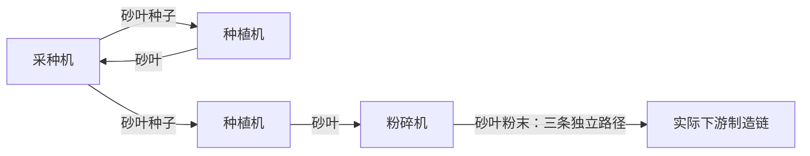

# 第81轮A组：堵满起法的三处运行条件

日期：2026-09-26。状态：本轮推导及两套独立复算完成；8条结论均待审。其中3条必要条件（1条限定明示的封闭植物分区）、5条充分条件，未得到保最优简化。

**一般的堵满起法仍未证成。** 本轮把混线的逐件接收判据推广到多路有比例保证的来料；把单种非成品兼用箱的保格证明延伸到明确停收条件后的恢复；对纯料、固定配对的植物组，证明了一个允许缓存有未排批次、下游任意停取再恢复的库存不变量。多种非成品共同中转、任意混线的实际料序、一般混做植物网仍有未闭合部分。没有取得新的达标全厂布局，也没有改变面积界。

## 一、依据、量词和材料范围

仅以下三份快照是证明前提；根目录同名文件没有作为前提。

| 快照 | SHA-256 |
|---|---|
| [前提快照/《明日方舟：终末地》游戏规则.txt](前提快照/《明日方舟：终末地》游戏规则.txt) | `6e64e3903a65536c530b363c9f3aef8c1bb2a1c1193e866799125dd047159924` |
| [前提快照/求解任务.txt](前提快照/求解任务.txt) | `1630ca1febec79b324aa3afb110be2d3330298e266c68b06415c3d1516108bac` |
| [前提快照/求解约束.txt](前提快照/求解约束.txt) | `0c05976f6063f3332db6ee19d7746052ef35148d7c2a12dfa396c7bb8753f30f` |

读过的背景包括根目录《讨论整理》《候选简化》《求解思路》《候选充分条件》和《事情》开头；第57—59轮G1—G4推导、充分条件汇总及相关复核段落；候选简化第2轮单种非成品清箱段和第3轮A、B的三处断点。它们用于确定问题及已有证明边界。下文使用的库存、安全区间、满路径移动等步骤均重新从快照规则证明，没有把候选的状态当成前提。

“充分条件”均只承诺条文写明的效果。排除永久互等不等于达到所需批次率；某组植物供得上给定粉末需求不等于全厂会提出该需求；箱内放得下不等于成品在共用入口竞争中能进去。

所有运行动作按逐个事件检查，同一时刻尚未完成的判定不能提前合并。涉及离线的条件覆盖改变接通先后后保留的真实库存、缓存、带上物品和次序，并覆盖多次改变；不能重新挑一个有利起态。涉及仓库恢复时，先写清能接收多少。正常运行的前缀界不能直接套在停收期间。

下文A、B、x是已有物品的数学变量，不是新增物品：研磨的A分别是蓝铁粉末、源石粉末或荞花粉末，B是砂叶粉末；封装的A、B是钢制零件、致密源石粉末；灌装的是钢质瓶、细磨荞花粉末。批次用量保留原配方的整数，不先约分批次。

## 二、候选条目

### 81A-01　兼用箱后格非成品的清头要求

类别：必要条件。

兼用箱后格非成品的清头要求：在任一达标循环态中，某协议储存箱即使仍在无线交付成品，每次从第j格物理取走非成品之前，第1至j−1格也必须全空；若其中某一格在整个循环中始终非空，则其后各格内的每种非成品都没有周期进货量或出货量。不能把这些后格中的非成品计入可周转库存。

据：快照游戏规则的协议储存箱、传输、物品格；快照求解约束的非成品零入库；循环态。

推导：物理取货只能取最小非空编号；前格始终非空就封住后格的物理取货。非成品在达标循环中又没有无线入库，后格非成品只增不减，周期复原迫使进货也为零。成品无线传输不受箱头编号限制，不能据此断言整个箱子停流。

状态：待审。

### 81A-02　兼用箱单种非成品保格及停收恢复

类别：充分条件。

兼用箱单种非成品保格及停收恢复：某协议储存箱只收两种成品及一种非成品x，持续供电并开传输，仓库始终拒收x。起态第1格有q件x，后五格只有成品或为空；物理取货只接收x。若由真实来路和可用取货服务独立给出的累计进、出件数U、V，在全部允许后续中每个事件后都满足1≤q+U−V≤50，且这些后续包括离线改序和成品仓库任意有限停收，则x始终只占第1格。仓库恢复到每次传输都能收下箱内全部成品后，不迟于5 tick的第一次传输清空后五格；此后箱内容量及编号不再阻挡成品收货。此条件不保证来路竞争中的成品进箱率。

据：快照游戏规则的协议储存箱、传输、端口、滞留；快照求解约束的端口速率；零干预运行、离线。

推导：按事件归纳，x收货不超过50，取货后不少于1，传输不动x，故它不侵入后格，成品也不侵入第1格。停收只能把成品积在后五格。恢复时传输逐种发送，不受前格x阻挡；第一次清空后，任意传输间隔最多新增18件成品，各种成品至多占一格，后五格足够。U、V必须来自把第一格容量暂时去掉的参考过程及可用服务，不能用成功收发量事后定义。

状态：待审。

### 81A-03　单条混线的逐件剩余存货判据

类别：充分条件。

单条混线的逐件剩余存货判据：一台只做a件原料A加b件原料B的机器，两格初存为x_A、x_B且无其他原料，只有一条不分流的混料进路。把包括初始在途货在内的真实来料顺序记为w。对其每个长度k的前缀，记两种件数为I_A(k)、I_B(k)，令m(k)=min(⌊(x_A+I_A(k))/a⌋,⌊(x_B+I_B(k))/b⌋)，r_A(k)=x_A+I_A(k)−am(k)，r_B(k)=x_B+I_B(k)−bm(k)。若下一件为A时r_A(k)<50、为B时r_B(k)<50，且机器持续供电开机、每批产物及每个可接收头件都能在有限时间内清出或到达，则每件来料最终都能收下，不会永久互等。仓库恢复后的清出保证及离线、停收改变后的所有真实料序都须满足此前提；本条不给批次率。

据：快照游戏规则的物品格、存货/取货物品格、缓存格、制造、配方、移动；快照求解约束的双料逐机收支与存货界。

推导：前缀已接收后，m(k)是从参考起点起只靠初存和此前缀最多能开工的总批数；把这些批次做完后，r是两格同时能达到的最小存货。下一件所属格小于50便能收下，再归纳下一件。若在第一个失败前缀r已为50，更多批次又缺另一原料，单线后面的原料不能越过头件，输出再通畅也不能解开。真实制造用时只增加有限等待。

状态：待审。

### 81A-04　多条混线按配方比例分段的接收保证

类别：充分条件。

多条混线按配方比例分段的接收保证：只做aA+bB的机器从两存货格各50件开始，至多有m条只送A、B且各自不分流的进路。令g=gcd(a,b)，每路的完整实际来料序列都能分成各含a/g件A、b/g件B的连续段，段内顺序任意；此分段必须连同旧在途货一直覆盖离线改序和停收恢复，不能在每次改序时丢掉未完成段。若mab/g<C，完整段起点取C=min(50(b−a)−[b(a−1)−50a], [50b−a(b−1)]−50(b−a))；若各路起点可落在段内，则把左侧改成2mab/g。再要求持续供电开机、产物有限时间清出、可接收的头件不会因本机外的原因无限扣住，则不会形成全部进路因满格挡住缺料而永久停机。两格各50时，任意段内起点的进路至多6条的研磨机、至多5条的封装机、至多6条的灌装机均通过此检验；本条不给各路份额或达标产率。

据：快照游戏规则的物品格、缓存格、配方、制造、端口；快照求解约束的双料逐机收支与存货界。

推导：Z=bq_A−aq_B不随开工改变。一条完整段的偏差增量为零，段内偏差在±ab/g内；从任意段内切点开始取差，范围扩大为±2ab/g。各路相加后仍严格避开A满而B不足、或B满而A不足的两个区域，故所有头件永久互等不可能。不同路可以不同步，实际接收顺序可以任意交错。

状态：待审。

### 81A-05　研磨机两格被非砂叶粉末占据的停机

类别：必要条件。

研磨机两格被非砂叶粉末占据的停机：零干预期间，一台研磨机的两存货物品格若分别被蓝铁粉末、源石粉末、荞花粉末中的两种占据，它就不能再开始新批次，且不能自行解除。每个达标循环态中，扣除这类研磨机以及存货误料占格的研磨机后，剩余可用研磨机仍至少32台；两类停机机器按并集扣除。

据：快照游戏规则的物品格、存货/取货物品格、缓存格、大制造单位、三条研磨配方；快照求解约束的物料流量、存货误料停机与可用台数。

推导：三条研磨配方都要砂叶粉末。两格已被两种其他粉末占据，砂叶粉末无格可进；已有两种粉末只有配上砂叶粉末才能进入缓存，也不能从存货口退出。已有缓存批次仅提供有限产出。循环所需研磨批率为31.5批/tick，每台至多1批/tick，故其余仍至少32台。

状态：待审。

### 81A-06　封闭植物分区的制造次数界

类别：必要条件（限定封闭植物分区）。

封闭植物分区的制造次数界：一组完整单位只含n_a台采种机、n_z台种植机、T个运输单位（其中b个桥接器）及B个协议储存箱，全部只装一种植物及其种子；所考察时段没有种子、植株进出或入库，也没有人为补取，缓存至多存各机一个合法批次。令初始种子与植株合计N_0、其中种子S_0，C=102n_a+101n_z+T+b+300B。则该段采种完成批数A≤C−N_0，种植完成批数Z≤S_0+2(C−N_0)，合计至多S_0+3(C−N_0)。所以这样的封闭分区不能无限次制造；这不证明全部运输格最终都被正确物品填满。

据：快照游戏规则的物品格、缓存格、采种机、种植机、运输单位、桥接器、协议储存箱、配方；回路守恒。

推导：采种每完成一批使种子加植株总数增加1，种植保持总数，故N=N_0+A≤C。逐种记账有S=S_0+2A−Z≥0。每台采种的两普通格最多100件，缓存最多2件；种植对应100加1，其余按规则容量相加，得到C和两个批数界。未完成投入按原料、完成后按产物计。

状态：待审。

### 81A-07　专种配对满库存的停收恢复

类别：充分条件。

专种配对满库存的停收恢复：对同一种植物，n台专做采种、2n台专做种植、n台专做粉碎：采种的两条种子出路一一接到全部种植机，种植的一条植株出路一一接到全部采种机和粉碎机；每台粉碎有k条粉末出路，荞花k=2、砂叶k=3。全部路径只含传送带和已确定方向的桥接器独立一轴，不争物品格，无额外通道、准入口或箱体；机器持续供电开机。若开始时各机存货格正确且有50件，各取货格至少50−k_v件正确产物（采种k_v=2、种植k_v=1、粉碎k_v=k），各路径满且货已滞留至少1 tick，缓存为空或至多一个相应合法批次，则此后每个制造开工消耗的输入都能在同刻补回，取货格始终至少50−3k_v件。粉末各末端的下游已能接收该件、且相邻取件请求至少隔1 tick时，任意停取再恢复的请求都能被满足，离线改接通先后不改变此保证。故下游恢复经证明的粉末取件节奏后，本组立即供得上该节奏；不能由本条推定该起态必能调出或全厂下游必有这个节奏。

据：快照游戏规则的存货/取货物品格、缓存格、制造、移动、判定、滞留、桥接器及植物配方；快照求解约束的端口速率；离线、零干预运行。

推导：先证单台原料不断的1 tick机器：批量k_v且恰k_v条出路，从取货格至少50−k_v起，库存一旦降到这个数以下，出货不再阻止整批入格；制造每tick补k_v，而每口每tick最多拿1，用含两端的事件计数得取货格至少50−3k_v，仍为正。再反证第一次输入补不回：两次开工至少隔1 tick，独占满路径的旧货已满足滞留，空位能逐格传回；上述正库存保证上游能补最后一件，故第一次失败不存在。此不变量允许下游任意停取，恢复时无需重新补种或重设轮询。

状态：待审。

### 81A-08　放手状态闭包与逐步交付核验

类别：充分条件。

放手状态闭包与逐步交付核验：对一张固定布局及可操作的调试方案，若有一个有限状态图，已证明它覆盖全部可能放手状态和规则允许的后续变化，包括离线改序、仓库停收及恢复，且未漏掉无货可动但时间继续的状态；在仓库持续能接收两种成品的每条边u→v上，记经过时间t及实际交付d_电、d_胶，若存在有界节点数值h_电、h_胶使20d_电−12t≥h_电(v)−h_电(u)、20d_胶−11t≥h_胶(v)−h_胶(u)，则该布局恢复接收后的每个可到达循环态都达到两种目标平均交付率。停收边不要求这些交付不等式，但其后状态仍须留在已覆盖图中。

据：快照求解任务的目标、循环态、零干预运行、离线；快照求解约束的四种不得依赖量；逐边不等式相加。

推导：沿任意连续接收时段相加，右侧只剩终点与起点的h之差，绝对亏欠被有限图上h的范围控制；除以时间便给出0.6与0.55的长期下界。沿循环相加，h差直接为零。离线和停收恢复闭包保证恢复后的状态仍受同一证明覆盖。图可以放宽规则但必须覆盖真实变化；流量表或几次模拟不提供这种覆盖证书。

状态：待审。

## 三、协议储存箱兼收非成品

### 3.1 哪些接法下不发生，哪些只排除了其中一项

| 接法或已证事实 | 排除的机制 | 仍须证明的内容 |
|---|---|---|
| 所有实际入箱来路只来自封装机、灌装机，且沿途没有其他注入，初箱也无非成品 | 非成品占格 | 来路容量、竞争、仓库停收后的积货 |
| 只转送一种非成品、传输关闭 | 无线抽走该料、异种编号互挡 | 满箱反压、供取先后、实际吞吐 |
| 仓库对某种非成品始终无余量 | 无线抽走该种物品 | 物理取货的编号和身份限制 |
| 没有物理取货，仓库可收下所有来料 | 物理清空低编号格造成的碎片 | 仍须满足入箱种类、进货和传输条件 |

第一行可沿实际有向来路归纳：末级配方只产两种成品，运输不改身份，没有新来源，就不会产生非成品。关闭传输只关闭无线功能；箱子的物理存取继续工作。仓库初始满的荞花、砂叶及两种种子，在全部仓库出口固定为原矿、玩家只拿成品之后仍满，提供了第三行的真实来源。源矿、蓝铁矿仍会出库，不能照搬“永久拒收”的推理。

### 3.2 多种非成品不能用总容量替代编号

81A-01把箱头限制用于仍在交付成品的兼用箱。证明中的两条出路必须分开：非成品不能无线出库；成品仍能从任意编号格传输，前格非成品挡不住无线交付。

设第j格后有一种非成品y。若第j格在周期每个事件切点都不空，取货从来轮不到后格；后格y也无无线出口。因此其中y数量不减。周期末逐格复原，迫使该格y在全周期零进货。若后格确有正物理通过量，取走它的那些瞬间前格就必须全部空。一个格刚取空又在同一时刻补回，仍有一个空格事件，不能把它算成“始终非空”。

这说明，多种非成品的恢复必须保留六个编号格的逐格身份，不能只记录总件数，也不能把物品种类看成固定的优先级。同种物品允许占多个格。规则允许先收一件荞花、一件砂叶，取走第1格的荞花，再收砂叶，使两格都各有一件砂叶；有限物品来自初始植物库存，先后由调试期可等待的单次供取实现。这个局部说明编号碎片真实可产生，不是全厂反例。

### 3.3 单种非成品保格的首次失败证明

81A-02使用一个明确的参考过程：保留真实来路、存取优先级、轮询、滞留、其他单位库存和仓库状态，把第1格替成始终标为x、没有容量上下界的计数器；后五格仍按真实规则存放成品，保留容量及停收反压。U计参考过程提供的x入箱事件，V计下游有空间、路径有资格取x的服务事件，参考计数器暂不因缺x而拒绝服务。证明q+U−V始终在1…50以后，这些放宽才都不被实际用到。必须从布局和边界供取证明参考过程及其前缀界，不能先记录真实箱子的成功量，再用“真实库存当然在容量内”当证明。

设在第一件不同于参考过程的动作之前，第1格一直为x且数量为q+U−V。下一次入x后至多50，按最小可放格必仍进第1格；下一次取x后至少1，故不会暴露后格成品；传输对x恒送零。三个事件都保持不变量，所以不存在由x越界造成的第一次不同。后格因成品暂时装满造成的反压仍照真实参考过程保留，不能把它从x的供取反馈中删掉。

条件的数值形式也可直接核验：若全部有关前缀的U−V最小值为L、最大值为R，包含空前缀，则可选整数q当且仅当`1−L≤q≤50−R`。例如L=−2、R=2给出q=3…48。这个界必须包括停收和离线后续。只在正常供取各每tick一件时得到的小偏差，不能用于“下游停了、上游还来”的阶段。

从任意事件切点都有供取差在−2…2的更强合同下，可按不依赖操作速度的办法清箱：暂隔成品来路，等旧成品传走，保持最终x进出路运行；清第1格后，其新积存至多2件。这是因为从它最近一次为空起，非空时每次物理取货都先取它，积存就是这段进货减可用服务，至多2；它为空时取后格的旧x也不会增加第1格存量。在任意时刻固定加25件x，此时有25…27件，以后有23…29件；再按任意速度逐格清第2至6格，最后接回成品来路。第1格此后不空不溢，后格清一次就保持无x。这里的合同还必须对清箱造成的反馈成立，否则这套准备法不能使用。

### 3.4 仓库满了再恢复

只要x的同一不变量在停收时仍成立，后五格可以装满成品，但x不会占过去。恢复到“下次传输能收下箱内全部成品，并且以后每次也能收下”的状态，持续供电和空箱也尝试传输的规则保证下一次可执行传输不晚于5 tick。它清除所有编号中的成品，与x的所在格、物理取货顺序无关。

第一次清空以后，两次传输之间最多有3个存货端口各在6个含端点的时刻收货，合计18件。两种成品的每种数量都小于50；物理取货只动第1格，后五格在下一次传输之前没有先清空低编号格的动作，所以每种成品至多占一格。两个格已经够用，五格足够；按事件归纳，容量失败不能首次发生。下一次仓库停收后再恢复，重复同一证明。

“仓库两种成品各刚腾一个空位”弱于这里的整批接收前提，不能据此宣称5 tick清空。多次只腾少量空间、来货继续积压时，要按实际传出量证明，不在本条快速清空结论内。箱外的成品入口若被非成品高优先来源长期占住，也不会由箱内空格证明得到补救。

### 3.5 本处未闭合部分

81A-01是适用于任意兼用箱的必要限制；81A-02只处理一种非成品。多种非成品要反复清前格才能周转，而成品会在这些空位形成时进入，无法沿用“第1格永不空”的证明。还没有得到覆盖这种编号变化的通用调试、停收恢复定理。

也未证明所有合格兼用箱都可改成只收成品且不缩小最大空矩形。同一3×3单位同时承担无线交付、物理中转、存量，拆开功能后需要真实位置、端口、供电和运行证明。局部的清箱合同并不完成这项保最优比较。

## 四、双料机器使用混线

### 4.1 不起作用的接法与额外缺口

两种料各有互不被另一料堵住的完整纯料来路时，一种满格不会把缺少的另一种藏在同一带头之后。若缺料有限时间补足、完成产物有限时间清走且机器持续开机，按下一批需要的两种料分别检查就能排除这种永久互等。独立性必须覆盖上游争用，不能只看机前两小段带。

这仍不是无损简化。每种纯料单口至多一件/tick；拆混线可能要新增端口、运输格或机器。只给数量不提供坐标和运行，不能证明原最大空矩形保得住。

81A-05记录另一个独立问题：没有“误料”仍可能永久停机。蓝铁粉末和源石粉末均是研磨机的合法输入；在没有砂叶粉末到来的调试阶段，让两条纯料来路各送入一件，就能占满两个种类位置。两种粉末可分别由蓝铁矿经精炼、粉碎，以及源矿经粉碎得到，来源明确。所有研磨配方都缺砂叶粉末，已有存货不能自行退出。这反驳的是“全部合法原料就足以继续研磨”的局部推断，不是达标布局或堵满简化的全厂反例。

三种主粉共有3种不同成对选择，正数量1…50给出7,500种两格数量组合；均不能凑出配方。实际达标循环的研磨批率至少为17+9+5.5=31.5，剩余每台至多1，所以可用机器仍至少32台。富余台数允许一台永久停下；不能把所有机器都不许停写成必要条件。

### 4.2 单条混线的精确接收检查

对固定的实际来料顺序，81A-03给出比统一安全开区间更精确的判据。已经收下一个前缀时，即使机器当前还在制造或出料等待，也可以在不再收新料的情况下，最终做完全部能做的批次。每次开工同时减少a件A、b件B，所以最大累计批数就是两个整除商的较小者m(k)，而r_A、r_B是同时最小的剩余存货。

若下一件对应的r小于50，等待已有批次和出货结束之后，必有空间接它；继续归纳。若对应r为50，即便把全部能做的批次都先做掉也没有空间；另一种原料已经不足一批，后面的料又越不过唯一头件。因此在第一个失败前缀处，这个局部确实会永久互等。没有放宽制造时间来宣称产率：逐批等待的时间有限，只用于证明接收终能发生。

一个重复词若每轮恰包含整数批配方用量，则m(k)每轮增加同一个整数，r的检验只需一轮及所有可能起点。若一轮仅含约分后的配方份数，先重复到原配方的整数批数再检查。例如封装的2件钢制零件、3件致密源石粉末只是原配方的五分之一批，不能把它当成一批制造。

停收期间制造可能等出料；有限停收结束后，若后续产物仍都能有限时间清走，原证明恢复有效。但上游混料顺序若随反压或离线改变，必须检查实际拼接后的新词，不能只对原循环词作循环移位。

### 4.3 反面例的真实来源及证据范围

[finite_mixed_source.json](推导81A/finite_mixed_source.json)给出有限供货局部：一个主料协议储存箱经直接相接的分流器进入汇流器，另一原料箱经普通传送带进入同一汇流器，再由一条带进机器；制造品由独立带进入空收货箱，三个箱都关传输。选择规则允许的主料存货级较早接通。主料每次都已就绪时，汇流器必须先收主料，故会提出下列有限连续段；不是凭空指定字符串。

具体坐标、九条实际通道、无重叠和供电交集由两套几何编码核对。主料分流器初有一件，另一原料的两格带各有一件，其余运输格空；主料箱再放总量减一，另一箱放总量减二。所有物品是规则配方可在调试期有限制造、搬入的物品。需要的箱容量未超六格、每格50。输入格允许在调试期准备，输出格及缓存起初空。

| 机器 | 提出来料段 | 两格各50时卡住的下一件 | 改为(0,50)时该有限段 |
|---|---|---:|---|
| 研磨机 | 102件蓝铁粉末，随后51件砂叶粉末 | 第101件蓝铁粉末 | 可全收，剩余(0,50) |
| 封装机 | 40件钢制零件，随后60件致密源石粉末 | 第31件钢制零件 | 可全收，剩余(0,50) |
| 灌装机 | 60件钢质瓶，随后60件细磨荞花粉末 | 第51件钢质瓶 | 可全收，剩余(0,50) |

在下一件B之前，从(50,50)最多开工⌊50/b⌋批，最多另收a⌊50/b⌋件A，下一件A就卡住。单条出货路足以在有限时间清走表内制造品，空收货箱容量足够，所以这个卡点不是假定出货无限快造成的。

这些是来源明确的局部失败，**不是一般堵满起法的保最优反例**：没有证明此局部嵌入了达标全厂，没有证明(50,50)及这些在途货一定由原起法同时产生，也没有证明改用其他接法会缩小空矩形。换(0,50)只给该有限段的接收成功，不给所有接通先后或无限生产保证。

### 4.4 多条混线：把全部通道的偏差相加

一批开工使`Z=bq_A−aq_B`减少ba又增加ab，故Z不变；来一件A增b，来一件B减a。若输出最终能清走、头件可到达，全部进料永久互等只可能是：

* A格50而B格少于b，所有待进路都只能先送A，此时`Z≥50b−a(b−1)`；
* B格50而A格少于a，所有待进路都只能先送B，此时`Z≤b(a−1)−50a`。

只要Z严格处于两界之间，这两种都不可能。如果机器一直不再开工，有限存货容量还使它只能再收有限件；各可接收头件又不会无限不到，最终必落入上述互等形态，矛盾。这证明的是机器不因这两种原料永久互等，不保证每条低优先来路都分到份额。

一条路每完整段含a/g件A、b/g件B，偏差总增量为零；所有A先来或所有B先来给出段内极值±ab/g。各路从完整段开始，相加范围为±mab/g；从任意段内开始，要减去各自起点偏差，保守范围为±2mab/g。各路不必同步，也不必按相同段内排列。这正是81A-04的充分检验。

| 机器 | (a,b) | 严格安全区间 | 两格50的Z | 每路完整段内最大偏差ab/g |
|---|---|---|---:|---:|
| 研磨机 | (2,1) | −99<Z<50 | −50 | 2 |
| 封装机 | (10,15) | −365<Z<610 | 250 | 30 |
| 灌装机 | (10,10) | −410<Z<410 | 0 | 10 |

六路研磨任意段内起点给Z∈[−74,−26]；五路封装给[−50,550]；六路灌装给[−120,120]，均严格安全。六路封装的统一保守范围为[−110,610]，碰到边界，**只能说这个统一检验不通过**，不能说六路封装必死。若所有路都从完整段起点开始，三种机型各至多六路均通过。

离线重置一个汇流器的轮询位置，可能把未完的一段截掉后再次从同一种料开始；一次固定顺序时能产生正确比例的词，不足以保证反复改序仍有上述分段。必须保留旧货、源头状态和未完成段，证整个实际词都满足条件。这个要求没有被程序中的排列枚举自动证明。

### 4.5 产率与保最优仍缺什么

上述两项新判据都不把“终能收下”扩大成“按时补足”。满速研磨需要每tick一批；封装和灌装还要满足5 tick配方及逐机需求。要交付全厂，仍须给出实际供货的时间下界、完成品清出的时间上界，以及各路竞争后的流量；81A-08提供一种可核验的全局证书形式。

从平均流量模型或人为排好的词，推不出这些词由布局在所有不得依赖量下真实生成。任意混线改成纯料且不丢最优的替换也仍未完成。

## 五、植物回路接回出口

### 5.1 闭口能证明的事

81A-06逐事件计数而不预设全线最后都满。未完成的采种缓存仍计一株，完成后改计两粒种子；种植未完成时计种子，完成时改计植株。所有内部移动相消，每次采种完成净增一件，种植净增零件。普通格和单批缓存给出C，故有限容量使采种完成总数有限，种植完成总数也随之有限。

这不证明停在哪：可能取货格差一件才满而缓存整批放不下，可能某一支路已经堵住、另一支路仍没有填满。即使制造最终全停，纯运输圈也可能还有移动。因此“等到制造不再动”不能替代“最终接法中每个需要的运输格、物品身份及各输入库存都达到启动条件”。

任意再生网的回路守恒只给周期或前缀账，不能保证某一台种植机眼前有种子。外送优先级压死回种的局部若任何调试都不能持续供给，不是“原本合格但堵满起法不行”的反例；本报告没有把这类例子用于否证简化。

### 5.2 单台单料机器的取货库存引理

81A-07用的引理不要求缓存起初空。机器始终有正确输入，1 tick做一批、每批产k件同种物品、恰有k条取货通道，初始取货格至少50−k，缓存为空或一个合法批次。取货不会从别的途径发生。

考察取货格降到50−k以下的一段时间。在这段中，整批产物总能放进取货格，不会因输出空间阻止制造；输入充足，所以第一次完成剩余时间至多1 tick，此后每tick一批。把这段的起点放在刚要从50−k继续取货的事件之前，取相距T tick的任一事件切点：

* 每个出口的成功取货相隔至少1 tick，含两端最多⌊T⌋+1件；k口合计至多k(⌊T⌋+1)。
* 考虑同刻先取货、后完成的最不利顺序，已经整批进入取货格的制造批数至少max(0,⌈T⌉−1)。

相减后，取货格仍不少于50−3k。T不是整数时还可更紧，但本证明保留这个对所有事件先后统一有效的下界。初始就在50−k时同样计算；从较大库存进入低库存段，只会得到更多余量。

现行有关配方k=1、2、3，得到47、44、41件，均严格大于零。证明覆盖任意实数相位、取货停顿和恢复；程序只用1、1/2、1/3 tick网格复算若干有限状态图，不以这些网格替代实数相位证明。

### 5.3 把引理用于固定配对植物组

下面是n=1、专做砂叶的接法示意。每根箭头都是独占的满运输路径；粉末箭头代表三条独立路径。证明还允许n较大时的任意一一配对，不要求全部拆成这个四机组。



每条采种、种植、粉碎的输入路径只给一台机器，路径中的运输格不与其他路争用。一次开工消耗一件输入，给末运输格一个空位。路径各格原有的货都满足滞留时，末格旧货先进机器，上一格旧货补下一格，如此反向传播空位；每格只是送出自己的旧货，再接一件新货，新货不在同刻继续向前。移动时间为零，持续尝试把有限条无争用的移动全部做完。

假设首次出现某台机器开工后输入不能补回。在此之前所有机器输入始终有50件，单台引理便分别适用。两次开工相隔至少1 tick，所以这条输入路径上次移动后接进的货，到这次也已滞留至少1 tick；第一次开工则由初态成熟条件保证。空位能一路传到上游取货格，而引理保证该格仍至少41件，不会缺少最后一件。首次补货失败不可能发生。

同样推理用于粉末的末端取货请求：相邻请求至少隔1 tick，路径就已经成熟；粉碎取货格仍有正确粉末，故能满足请求并把路径重新补满。多个出口同刻要货也不构成争用，每条路径恰需一件，取货库存下界在逐个事件之后仍为正。接通先后及级内轮询只改变这些移动的先后，不改变各条路径补回的件数。

于是得到一个从启动后一直保持的不变量：制造输入满、全部指定路径满、制造输出保有上述正下界。缓存可以制造、等待整批入格、再开工，不需要强行复原到空缓存。

### 5.4 停收、恢复和半整数需求

下游不取粉末时，其路径仍满，不变量不要求下游必须取。反压使有关机器少做或停做，不能把输入抽空；任意有限停顿和离线后，仍在同一不变量中。下游重新发出合法取货请求，路径当即能供给，植物组没有额外的补种或轮询重设动作。

这里承诺的“当即”指已满足滞留、相邻请求间隔合法时，零时间移动可以完成；并不要求制造凭空在同刻新做出粉末。供给来自满路径及已有库存，后续批次自动补回。

如果下游恢复每条粉末路恰每tick取一件，则每台粉碎每周期输出kT件，库存和在制周期复原迫使完成T批，因此满速。若实际下游每条路每2 tick取一件，同理给出半速。更一般的合法取件节奏也按逐路实际交付计算，不要求所有粉碎都满速。

因此该充分族可以在**下游服务已另证**的条件下提供目标所需半整数植物量：

| 植物 | 配对数n | 下游粉末取件安排 | 每20 tick粉碎及采种批数 | 每20 tick种植批数 | 每20 tick粉末 |
|---|---:|---|---:|---:|---:|
| 荞花 | 6 | 五台粉碎各两路每tick一件，一台各两路每2 tick一件 | 110 | 220 | 220 |
| 砂叶 | 11 | 十台粉碎各三路每tick一件，一台各三路每2 tick一件 | 210 | 420 | 630 |

这里分别是荞花粉末11件/tick、砂叶粉末31.5件/tick。任意完整植物分区的周期收支给采种批数等于粉碎批数、种植为其两倍；没有假定某一台采种一定只服务某一台粉碎。两个物种分别做这样的配对，合计采种17台、种植34台、粉碎17台，制造单位自身占1428格，未计运输、供电、核心及其余生产。

取件时序是下游接口条件，不是让玩家按tick拿粉末，也不是假定仓库可长期接收非成品。粉末必须送往全厂实际制造链；表格没有构造这个全厂。若后续接口最终按上述周期运行、不得依赖量在一次运行段内固定，则库存有界、事件相位只有初始有限相位加整数tick及周期请求相位；完整局部状态可有限编码，确定性运行最终重复。即使不使用这点，逐次满足请求的证明已经覆盖每个实际可到达的局部循环。

### 5.5 这个证明没有跳过接回和调试可达性

充分条文从**最终接法已经连好**、每条指定路径都满且成熟开始。若接回出口新添了空运输格，或把原来的物料换了路径，它就没有满足此前提。只关闭末级、先断植物出口，再直接接回，是否一定能到达这里的状态，仍须由具体布局证明。

对用这个充分族造图的做法，可以在调试期先把最终出口接回、末级仍关着，再验证最终连通图上的上述库存条件，等货已满足滞留后放手；等待更久不应破坏已证的准备状态。但“这样等待就一定填满”未由本轮证明。需要精确到某tick才成立的准备状态也不能直接使用。

本族排除了混种、共享运输格、协议储存箱和多种优先分配，属于收窄的充分做法。17台采种和34台种植比机型下限多，不能说改用它不丢最优。一般混做植物回路、接回造成分配改变以及起态可达性，仍是本处的剩余断点。

## 六、如何接成全厂交付证明

81A-08给出一份证书必须承担的事情，而不是声称本轮已经生成这份全厂证书。有限图可以比真实运行宽，但必须有逐状态、逐转移的覆盖证明；单看“存在平均流量”的解没有这种映射。

状态至少要保留影响后续的存取格身份和件数、在途物品和滞留、缓存批次及进度、轮询位置、实际优先级、准入口的累计及窗口状态、传输冷却和仓库余量。若合并其中某些状态，须证明合并没有漏掉真实后续。单纯把时间取成整数tick，不能未经证明忽略相位。

图的起点集合由可操作的调试方案给出，包含不精确操作产生的全部状态。离线改变接通先后是从现有库存出发的转移；仓库停收及部分恢复也如此。这个集合连同后续必须封闭。满库存植物不变量、箱子的第1格不变量、混线前缀判据分别只能支撑其中一部分。

对连续可接收的时段，逐边相加81A-08的两个不等式得

`20D_电≥12T−H_电，20D_胶≥11T−H_胶`，

其中H是相应节点数值的最大值减最小值。它把恢复后的有限亏欠限制为与停收持续多久无关的常数。沿完整循环节点数值复原，直接得到0.6与0.55；即便抽象映射在一次物理周期后未落到同一个节点，把该真实周期反复走并用有界H，仍得到相同周期平均结论。

停收边不施加交付率要求；恢复后仍落在覆盖图中，故同一个证明再次适用。没有物品能动、时间却继续的状态必须有时间边：否则删掉死锁状态的等待会伪造交付保证。长期接收但永不交货的时间循环不可能通过这些不等式。

本轮没有交付整座70×70布局对应的这张图或h。因此不能把八条候选合起来宣称L已经提高，也不能把“逐处没找到死锁”当作全厂达标证明。

## 七、额外缺口和三处的终态

| 项目 | 本轮已经证明 | 仍然欠缺 |
|---|---|---|
| 协议储存箱兼收非成品 | 兼用时的后格必要限制；单种非成品保第1格及强接收条件下的自动恢复 | 多种非成品的编号变化；服务合同含全厂反馈的证明；任意部分腾仓的恢复；无损替换 |
| 双料机器用混线 | 单线逐件剩余存货检查；多路比例段的合计安全界；双主粉永久停机 | 布局生成全部实际词及旧货拼接；按时供料和成品出货；一般保矩形分路 |
| 植物回路接回出口 | 闭口制造次数界；固定纯料配对在明确起态下对任意停取的库存不变量及恢复供给 | 最终全满起态的调试可达性；一般混做、争格和跨区分配；无损改成该充分族 |

另外四处不能由“堵满”省略：

1. **缓存状态。** 堵稳可以留下已完成但放不进取货格的一整批；不能默认缓存为空。81A-07已允许合法的在制或等待批次；其他证明仍须各自处理。
2. **旧在途货与离线。** 不能只检查新产生的周期词，不能每次离线后重新给偏差记零。一次好循环不提供恢复闭包。
3. **准入口断开。** 每5 tick上限设5，按0、1、2、3、4收下第五件时额度仍会用尽，规则仍触发断开。“通常吞吐不降低”不是“不会断开”；依赖恢复的布局还要证明所用恢复语义。81A-07特意不使用准入口。
4. **实际下界。** 下游最大处理能力不是实际取货保证，混线终能接收不是所需批次率，有限植物初存不是无限回种。全厂证明需要81A-08那样能覆盖每个真实后续的交付证据，或同等强度的直接证明。

没有给出“所有达标布局都可无损改成这些充分接法”的论证；也没有给出一张原本达标、采用堵满必失败且无法保目标替换的全厂反例。故堵满起法的一般保最优命题保持未证，不判已证也不判已否证。

## 八、复算证书、范围与复跑

两套独立编码均为`PASS`。程序只用Python标准库并固定在一个CPU上；没有运行内核测试、外部求解器或并行任务。

| 核验对象 | 主编码 | 独立编码 | 结果 |
|---|---|---|---|
| 三种双料配方的剩余存货 | 整除商直接求可开工批数 | 每批实际扣除两种原料直至不能开工 | 7803个起存对一致 |
| 多路偏差界 | 每路极值及公式相加 | 枚举段内排列、前缀差及逐路和的集合 | 36组界一致 |
| 有来源的有限混线例 | 逐前缀剩余存货递推 | 逐件收货、逐批扣料 | 6个起存/来料例一致 |
| 有限混线局部的接线 | 占格端口相邻图 | 单位边界中点对接图 | 9条实际通道一致 |
| 箱子恢复时清除后五格成品 | 按物品身份清除 | 按仓库余量逐格传输 | 156250个代表性状态一致 |
| 单料取货库存 | 逐事件结算整批入格和取货 | 直接计算时间步内取件后的整批转移 | 9个图、529状态、1319转移，状态散列一致 |

箱子枚举的尾格数量取空、1或50，是检查身份及整批清除的代表状态，不是声称枚举了所有箱体轨迹；一般数量及相位由第三节证明。单料图的时间网格为1、1/2、1/3 tick，得到的最小取货库存依次为：k=1时49、48、48；k=2时48、46、46；k=3时47、44、44，均高于解析保守下界47、44、41。一般实数相位由第五节引理证明。

这些核验不涉及全厂几何、最终满库存起态的可操作到达、上游混料生成的全部情况或全厂达标。没有超时项；未完成处是上表明确列出的证明缺口，不是把超时当成否证。

从仓库根目录复跑（各命令顺序执行）：

```bash
python3 -B 求解器/候选约束轮次/第81-83轮/推导81A/check_primary.py
python3 -B 求解器/候选约束轮次/第81-83轮/推导81A/check_independent.py
python3 -B 求解器/候选约束轮次/第81-83轮/推导81A/build_report.py
```

文件：

* [结论数据](推导81A/conclusions.json)：八条条文、类别、据、推导及待审状态。
* [主编码](推导81A/check_primary.py)、[独立编码](推导81A/check_independent.py)。
* [主结果](推导81A/primary_results.json)、[独立结果](推导81A/independent_results.json)。
* [单料有限图证书](推导81A/buffer_certificate.json)、[有限混线接法](推导81A/finite_mixed_source.json)。
* [主日志](推导81A/primary.log)、[独立日志](推导81A/independent.log)。

