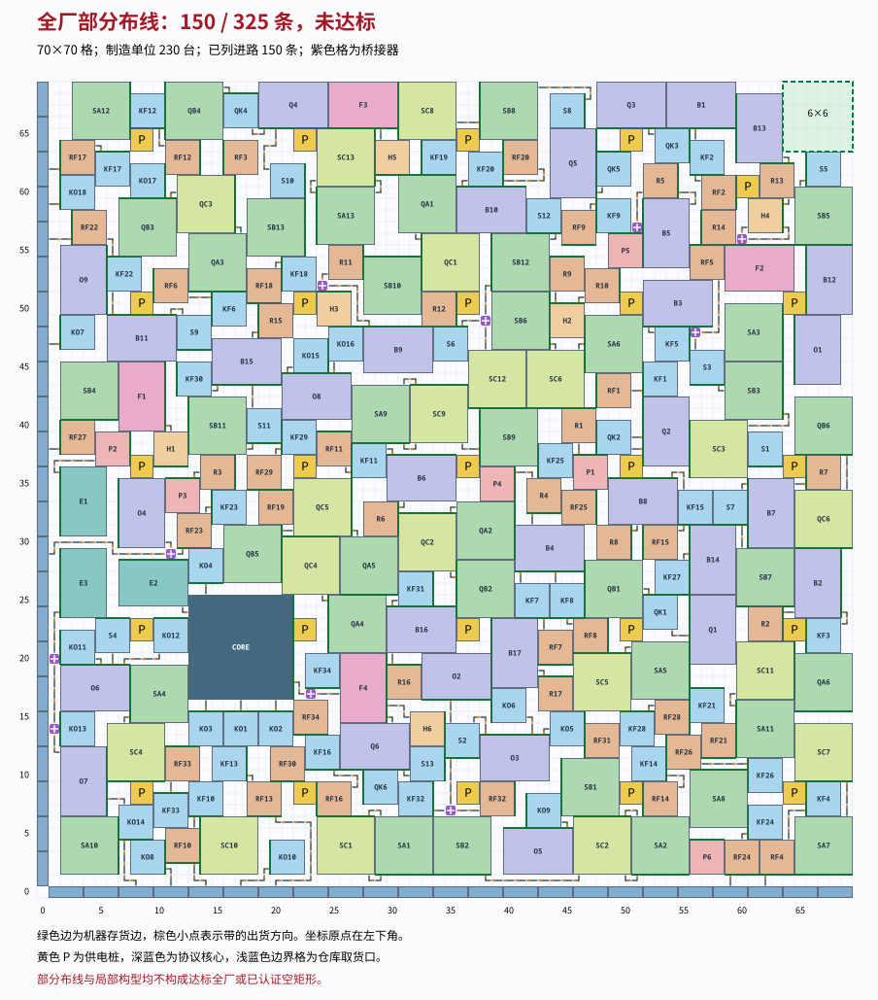

# 构造 A：允许桥接器的 S2 全厂布局搜索

日期：2026-10-02。状态：**完成本次求解：未找到合法全厂布局；`static_pass=false`，运行未认证，L 仍为0。**

交付的[未通过候选](构造A/未通过候选.json)有230台制造单位的完整坐标、协议核心、46个仓库取货口、25个供电桩，以及150条实际接通进路。它缺少175条S2进路，不能作为达标全厂。本次没有已实现的合法全厂空矩形，也没有证明允许桥接器的全部S2接法在70×70内无解。

这张失败候选的主要问题有直接证据：**固定它的非运输单位坐标和朝向后，即使移除全部运输单位，并允许占用原预留空矩形，仍有135条指定进路连单独寻路都不可能。** 证据只针对这组固定摆放；修复必须改变非运输单位的位置或朝向。

| 交付物 | 当前结论 |
|---|---|
|[候选JSON](构造A/未通过候选.json)|`full-factory-static-v1`，真实坐标和部分接线，未通过|
|[布局图SVG](构造A/图/失败候选布局.svg)、[PNG](构造A/图/失败候选布局.png)|明确标注“部分布线，非可行全厂”|
|[自写静态检查器](构造A/代码/static_check.py)、[结果](构造A/证据/静态检查结果.json)|未通过；具体失败项见下表|
|[不可连通证书](构造A/证据/固定摆放不可连通证书.json)、[独立两套编码](构造A/代码/connectivity_certificate.py)|BFS与并查集一致，135条进路无路可走|
|[旧A模块复查](构造A/检查器A/组件复查结果.json)、[旧B模块复查](构造A/检查器B/组件复查结果.json)|占格、通道、路径计数一致；平均流均精确不可行|
|[整数模型](构造A/整数模型.md)、[搜索程序](构造A/代码/)|有实际执行记录；受限搜索失败不扩大为全类无解|
|[格式扩展说明](构造A/格式扩展.md)|说明相邻桥真实逆向通道和局部诊断字段；主候选无需扩展|
|[复跑入口](构造A/代码/replay.py)、[复跑结果](构造A/证据/复跑结果.json)|重新核验失败证据，预期静态检查退出码为1|



输入依据为第107—109轮的115行规则、任务、77条约束、11条充分条件及临时规则，均已[冻结](构造A/依据快照/)并记录[来源与SHA-256](构造A/证据/输入指纹.json)。S2的230台、325路逐项与第二份独立转写相同；机器占地3567格，完整接法的非运输—运输接口650个，抽象接法的精确物料守恒通过[双重算术核验](构造A/证据/双重算术核验.json)。这些是接法与算术检查，不是几何或运行证明。

| 检查项 | 结果与范围 |
|---|---|
|70×70内、不重叠、单位尺寸与朝向|通过|
|230台指定机型、配方和制造开关|通过|
|一个协议核心、六口均设源矿；46个取货口均贴左/下边界|位置与设定通过；不代表52条矿石进路均接通|
|供电桩覆盖|230台制造单位均有供电|
|已建运输单位|310个实体，其中双轴桥10个；运输物品格320个|
|自动通道|独立重建470条，声明与实际一致，已接通部分无多余通道|
|S2完整接法|失败：150/325条，缺175条|
|H6→F4与Q6→F4等长|失败：H6→F4为3格；Q6→F4为1格|
|全厂平均流|失败：旧A、B均给出精确不可行证据|
|完整调试及所有可达循环态达标|未认证；静态前提已经失败|

旧检查器只复用了其未改动的几何、接口与连续平均流模块；[包装入口](构造A/代码/legacy_components.py)绑定本轮冻结文件，并记录[副本字节指纹](构造A/证据/旧检查器副本指纹.json)。没有声称旧检查器的完整77条台账、时间模型或版本闸门已适配。三份几何实现均算得占地4196格、实体通道470条、进路150条；自写的两种最大空矩形算法与旧A/B也一致。

旧B的平均流证据是 `source:('WFE1', 0, 1)` 这一行：真实取货端口没有通道，其流量和为0；全厂矿石要求该端口为1件/tick，故得到 **0=1**。旧A独立建立的矩阵另得到已用精确有理数复核的Farkas证书，证书右端为 `2804/15`。这两项都只否定该失败候选的实际接线。

固定摆放的不可连通结论覆盖更大的路由放宽。把全部非运输单位的占格标为不可通行，其余格都允许运输、任意转弯和无限容量，也不保留空矩形限制。桥接器仍只能连接正交相邻空格，不能穿过机器机身，所以每条真实进路的首尾格必须在这个放宽图的同一连通块中。

两套独立实现分别使用二维集合+BFS、扁平占格数组+并查集，得到非运输占格3886、剩余空格1014、连通块127。按全部真实可用端口枚举首尾，有135条进路的首尾连通块集合不相交。完整格清单和逐路结果都保存在证书中；下表仅列三个例子，连通块编号是证书内部编号。

|进路|真实起点与终点|起点可达块|终点可达块|
|---|---|---|---|
|LF000|仓库取货口 WFE1 → 精炼炉 RF1|[1]|[82]|
|LF002|仓库取货口 WFE2 → 精炼炉 RF2|[1]|[112]|
|LF004|仓库取货口 WFE3 → 精炼炉 RF3|[1]|[26]|

因此，在这些固定非运输坐标下，无论怎样拆换传送带、增加桥接器、使用相邻桥或撤去空矩形预留，都不能补齐全厂。缺失的其余40条进路只记为未接通；没有用一次启发式布线失败证明它们各自不可能。

候选实际用了10个桥接器，全部双轴在用、两轴属不同进路；相邻桥对数为0，最长同轴桥串为1，没有单轴桥。各轴逐条列在下表，单位名采用规则中的机型名，字母编号沿用S2及逻辑接法。

|桥接器格坐标|水平轴进路|竖直轴进路|
|---|---|---|
|(1,14)|LF080：仓库取货口 WO13 → 粉碎机 KO13（源矿）|LF305：研磨机 O7 → 封装机 E3（致密源石粉末）|
|(1,20)|LF078：仓库取货口 WO11 → 粉碎机 KO11（源矿）|LF305：研磨机 O7 → 封装机 E3（致密源石粉末）|
|(11,29)|LF044：仓库取货口 WFE23 → 精炼炉 RF23（蓝铁矿）|LF299：研磨机 O4 → 封装机 E2（致密源石粉末）|
|(23,17)|LF324：灌装机 F4 → 协议核心（精选荞愈胶囊）|LF067：精炼炉 RF34 → 粉碎机 KF34（蓝铁块）|
|(24,52)|LF103：粉碎机 KF18 → 研磨机 B9（蓝铁粉末）|LF284：精炼炉 R11 → 塑形机 H3（钢块）|
|(35,7)|LF063：精炼炉 RF32 → 粉碎机 KF32（蓝铁块）|LF145：种植机 SB2 → 粉碎机 S2（砂叶）|
|(38,49)|LF161：种植机 SB6 → 粉碎机 S6（砂叶）|LF183：采种机 SC12 → 种植机 SB12（砂叶种子）|
|(51,57)|LF094：粉碎机 KF9 → 研磨机 B5（蓝铁粉末）|LF278：精炼炉 R5 → 配件机 P5（钢块）|
|(56,48)|LF009：精炼炉 RF5 → 粉碎机 KF5（蓝铁块）|LF219：粉碎机 S3 → 研磨机 B3（砂叶粉末）|
|(60,56)|LF287：精炼炉 R14 → 塑形机 H4（钢块）|LF316：塑形机 H4 → 灌装机 F2（钢质瓶）|

本轮读入的[S2B候选稿](构造A/依据快照/推导107S2B-读入时.md)允许任意有限的同轴相邻桥串，并要求保留真实逆向通道及正向来源记录的调试起态。这里的主候选没有相邻桥。检查器还通过了[单桥交叉](构造A/证据/单桥交叉-局部检查.json)与[三桥相邻](构造A/证据/三桥相邻-局部检查.json)的局部端口对照；删除带、写错桥方向、漏报通道都会被拒绝。局部样例不是全厂运行证书。

实际搜索先尝试固定6×6空区，并另执行不要求空矩形的摆放子问题。没有获得完整合法布线，所以没有把空区逐步增大当作已完成的优化阶段。

表中的146路参照摆放来自[四向旋转尝试](构造A/实验/routing-four-dir-11.json)，150路参照摆放来自[边界取货口前方留空尝试](构造A/实验/routing-sources-21.json)。所谓“外扩r格”是允许每台制造单位及核心的整个占格落在其参照机身外扩r格的矩形内；取货口和供电桩固定，桥不相邻，仍要求全部325路、等长、供电及6×6空区。这不是对所有70×70摆放的覆盖。

|实际执行的模型范围|结果|证据|
|---|---|---|
|端点摆放子问题，固定25桩和6×6预留区|`UNKNOWN`；600.02秒|[记录](构造A/实验/placement-01.json)|
|逐格联合模型，区域范围、25桩、6×6预留区|`MEMORY_LIMIT`；见日志|[记录](构造A/实验/joint-full-01.json)|
|最多三段的完整325路模型，固定25桩和取货口次序|`UNKNOWN`；910.55秒|[记录](构造A/实验/polyline-full-01.json)|
|匿名摆放，固定5条横/竖走廊、桩位与核心|`INFEASIBLE`；74.85秒|[记录](构造A/实验/skeleton-01.json)|
|匿名摆放，固定3条横/竖走廊、桩位与核心|`UNKNOWN`；300.06秒|[记录](构造A/实验/skeleton-02.json)|
|匿名摆放，无走廊、无空矩形预留，仍固定桩位和核心|`UNKNOWN`；420.05秒|[记录](构造A/实验/packing-no-rectangle.json)|
|围绕146路尝试的外扩4格逐格模型，固定桩和取货口|`INFEASIBLE`；64.44秒|[记录](构造A/实验/joint-neighborhood-06.json)|
|围绕同一146路尝试的外扩6格逐格模型|`MEMORY_LIMIT`；见日志|[记录](构造A/实验/joint-neighborhood-06wide.json)|
|同一外扩6格模型，单线程关闭LP松弛|`UNKNOWN`；1201.07秒|[记录](构造A/实验/joint-neighborhood-06-nolp.json)|
|围绕150路尝试的外扩6格逐格模型，带已有进路提示|`UNKNOWN`；899.61秒|[记录](构造A/实验/joint-neighborhood-sources-hint.json)|

`INFEASIBLE`只覆盖表中明确固定的模型范围；`UNKNOWN`和内存限制不表示不可行。`joint-neighborhood-04.json`是无效配置记录，不是不可行证据：它的固定桩编号与额外排序冲突。有效的4格范围判定来自`joint-neighborhood-06.json`。部分进路模式允许未启用端点在基地外；[全关闭对照](构造A/实验/polyline-control-vector.json)仅验证坐标建模，不是达标布局。

关键模型对照包括：两种独立联合编码在固定15×11局部采种单元上都得到7个运输格；60张小网格上，两种最大空矩形算法与完整坐标穷举一致。详见[组件对照](构造A/证据/静态检查组件对照.json)。没有运行内核的cargo测试，没有执行或声称完成全厂动态模拟。

这张失败候选的几何最大空矩形是 **6×6，左下角(64,64)，面积36**。它只是一个未达标候选的几何属性，不能把36计为已实现的全厂下界，也不能据此声称与可达上界相差某个数。

任务给定的正式全局上界仍为1110、L仍为0。约842是该固定接法的面积预算，不是存在性保证；S2B新稿§9.3进一步用650个实际接口收紧到整数面积835、合格尺寸乘积833。两套独立程序复算这个数值一致，但本报告不独立认证新稿的方向计数证明，也不据此修改正式U。当前与面积预算之间的首要差距是完整几何接线尚不存在于交付候选中。

在项目根目录复跑证据：

```bash
python -B '求解器/构造/第三张全厂候选/构造A/代码/replay.py'
```

此入口不重启长时间搜索，不跑运行内核，只写构造A目录。复跑成功表示所有记录的失败证据和计数可复现，静态结论仍是未通过。搜索和交付文件仅写在第三张全厂候选范围内，未使用git。交付前的[读者自审](构造A/证据/读者自审.json)与[文件清单](构造A/证据/文件清单.json)记录文本核对和字节指纹。
