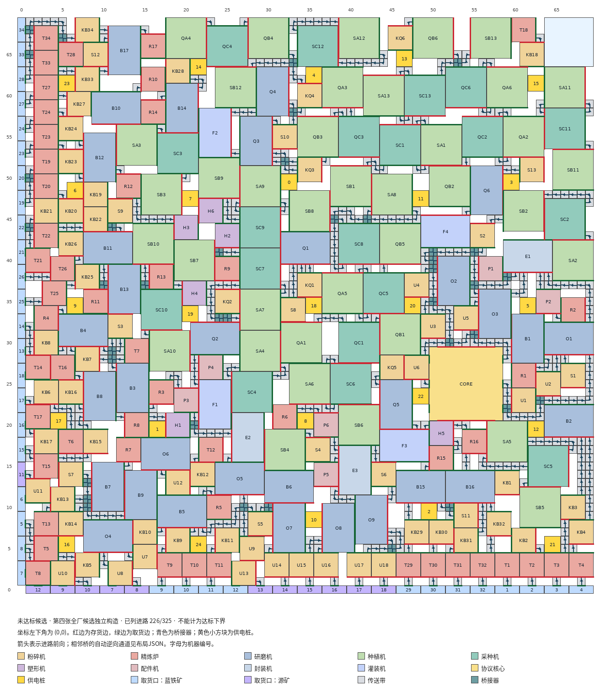

# 第107轮桥接器接法：独立构造结果

日期：2026-10-02。状态：**本轮未找到达标全厂，`static_pass=false`。** 主候选接通226/325条进路，缺99条；230台制造单位均有供电。正式下界L仍为0。本结果没有证明该接法在所有70×70布局中不可实现。

主候选为[布局.json](独立/布局.json)，SHA-256为`729fde6011f4eeb9b31ea58342e3c5293b1eb3ba0983877b95eb9250c349cd78`。它的几何最大空矩形是 **6×6，左下角(64,64)，面积36**；这块空地属于未达标候选，不能计为下界。



## 交付文件

- [布局JSON](独立/布局.json)、[布局图SVG](独立/布局图.svg)、[布局图PNG](独立/布局图.png)。
- [自写静态检查程序](独立/代码/check_static.py)、[静态检查结果](独立/静态检查结果.json)。检查结果以实体坐标、端口和自动通道重建，不把声明的进路当成已接通事实。
- [230台逐台核查表](独立/逐台核查.tsv)、[325路逐路核查表](独立/逐路核查.tsv)，包括全部缺路。
- [独立几何数字复算](独立/结果/独立几何数字复算.json)、[9类错误的拒绝性检验](独立/结果/检查器拒绝性检验.json)。
- [迭代索引](独立/迭代索引.tsv)、[原始状态和日志](独立/迭代/)、[整数模型结果索引](独立/结果/整数模型结果索引.json)、[执行状态](独立/执行状态.json)。
- [格式及恢复说明](独立/格式说明.md)、[本次接法](独立/逻辑接法.json)、[规则依据快照](独立/依据/)。

## 主候选核验

|项目|核验结果|
|---|---|
|70×70内、单位尺寸、旋转、占格互斥|通过|
|制造单位|粉碎机71、精炼炉51、研磨机32、塑形机6、配件机6、种植机38、采种机19、封装机3、灌装机4；共230台，机身3567格|
|配方及制造开关|230台与第107轮逐台接法一致，制造开关全开|
|协议核心|一个9×9核心，六个取货端口均设源矿；设定合法不代表六路都接通|
|仓库取货口|46个，左、下各23个；34个设蓝铁矿、12个设源矿|
|供电|25个2×2供电桩，230台制造单位全部覆盖|
|已建运输单位|520格传送带、38座桥接器，共558个实体，占用596个运输物品格|
|自动通道|827条，其中前向822条、相邻桥逆向5条；声明与重建一致，无额外通道|
|已接进路|226条，均属于指定接法；逐格连续、至少一格、不重复物理单位、不共用运输物品格|
|桥接器|双轴分属不同进路；5对相邻桥，最长同轴直串3座；逆向通道完整列出|
|禁用单位|没有分流器、汇流器、物品准入口、协议储存箱或虚拟接口|
|完整接法|失败：缺99条；矿石进路接通40/52，成品入库接通1/7|
|H6→F4与Q6→F4等长|失败：塑形机H6→灌装机F4缺失；研磨机Q6→灌装机F4为1格|
|全厂平均物料收支和交付目标|失败；缺路的实际图不满足规定的全厂流量|
|几何最大空矩形|6×6，(64,64)；二维前缀和枚举4601025个候选矩形，确认位置唯一|

当前唯一成品入库路是灌装机F4→协议核心，运输物品格数14。三台封装机都没有入库进路，不能持续向仓库交付高容谷地电池。未执行全厂调试或动态运行；全部可达循环态达标未认证。

## 具体阻塞与结论范围

**84条缺路被固定机位阻断。** 撤去全部运输单位，固定制造单位、协议核心、仓库取货口和供电桩，允许所有剩余格任意转弯、交叉，连原空矩形也允许经过，仍找不到相接的首末运输格连通块。余下15条缺路只记为未接通，没有证明它们可以同时布出。逐路清单见静态结果和逐路核查表。

**这组机位还违反运输格数的必要条件。** 对325条进路，各取首末运输格横向距离加纵向距离再加1的最小值，相加为2301。这一步忽略障碍、端口争用和进路冲突，只会低估运输物品格需求。非运输占格为3886；保留至少6×6空地后，至多剩978个运输实体位置，即使每一格都使用双轴桥，也至多提供1956个物品格。`2301>1956`，所以保持逐台坐标与朝向，仅拆换运输单位不能补成完整接法。

这些是对主候选的拒绝证据，不是第107轮接法全类无解的证明。833是该接法的面积预算上界，不是可实现值；主候选不达标，因此不计算“833减去36”作为最优性差距。

## 实际搜索与存档

先按七台成品机的上游分组粗摆；反复执行拥塞加权寻路、拆线重布、机身移动与旋转、同尺寸交换及成组推移。随后保留不受影响的线路，只拆除被移动机身影响或与缺路争用的线路；增加矿石链、采种单元等区块的身份重分配。仓库取货口的设定和位置映射始终维持34条蓝铁矿、12条源矿，协议核心六路仍为源矿。

摆放调整同时使用单路可达性、端口缺口、实际已接进路数和运输格数需求。另实际运行了局部整数重摆、为缺路预留运输格、固定机位的全局端口指派、全厂端口修复，以及小制造单位的重新装填。整数模型的`FEASIBLE`只表示其记录的子问题可行；端口指派不是实体进路。`UNKNOWN`不表示不可行，局部`INFEASIBLE`只覆盖该次固定的范围。

运行中保存了8670份含完整机位和路径列表的搜索状态；索引逐份记录路径、阶段数据及SHA-256。外层摆放与布线轮次通常每30—40秒保存快照，整数子问题的输入、结果和找到的坐标也分别保存。内层单次扰动不是独立交付布局。未接通全部325路，因而没有进入扩大预留空矩形的阶段。

在项目根目录执行下列命令可重算主候选检查，不启动长时间搜索：

```bash
bash '求解器/构造/第四张全厂候选/独立/复核.sh'
```

复核程序正常结束只表示记录重新算完；布局是否通过必须读取`static_pass`，当前为false。原检查器A/B未作本次全厂认证。自写检查器覆盖上述几何、端口、通道、配方、供电、固定接法、等长和有理数收支。

本次墙钟约4小时0分，搜索与求解进程亲和性限定在CPU 0—5，单次整数求解至多4个工作线程，并与其他计算共享这6个核。输入文件字节核验见[输入未改动核验](独立/结果/输入未改动核验.json)。

注：迭代存档 独立/迭代/（约 1.5G、2.5 万个文件）已由主会话压成 独立/迭代.tar.xz（20MB），解压即还原原路径。
