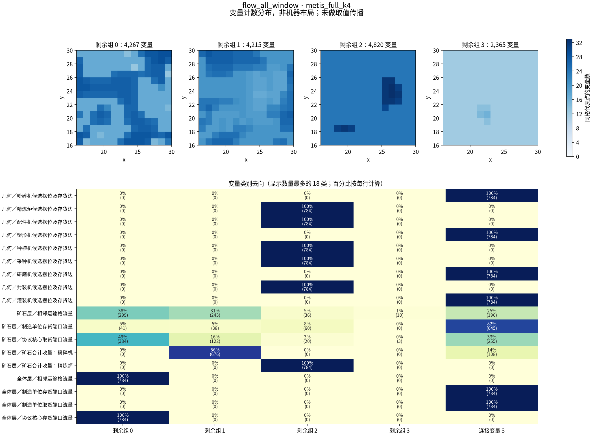
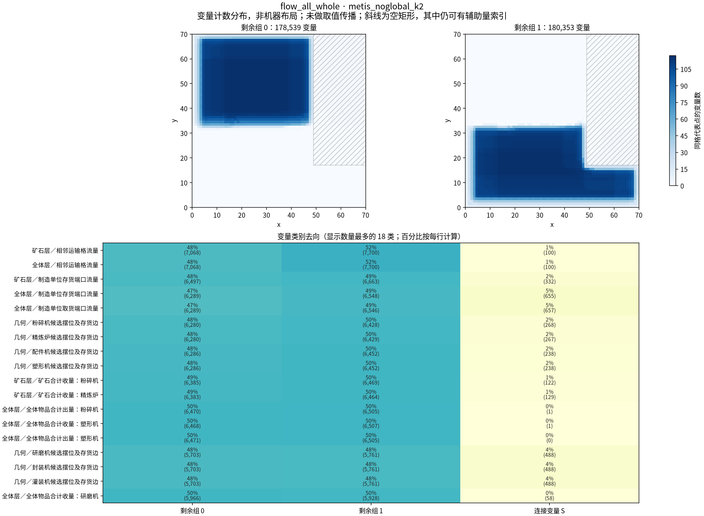
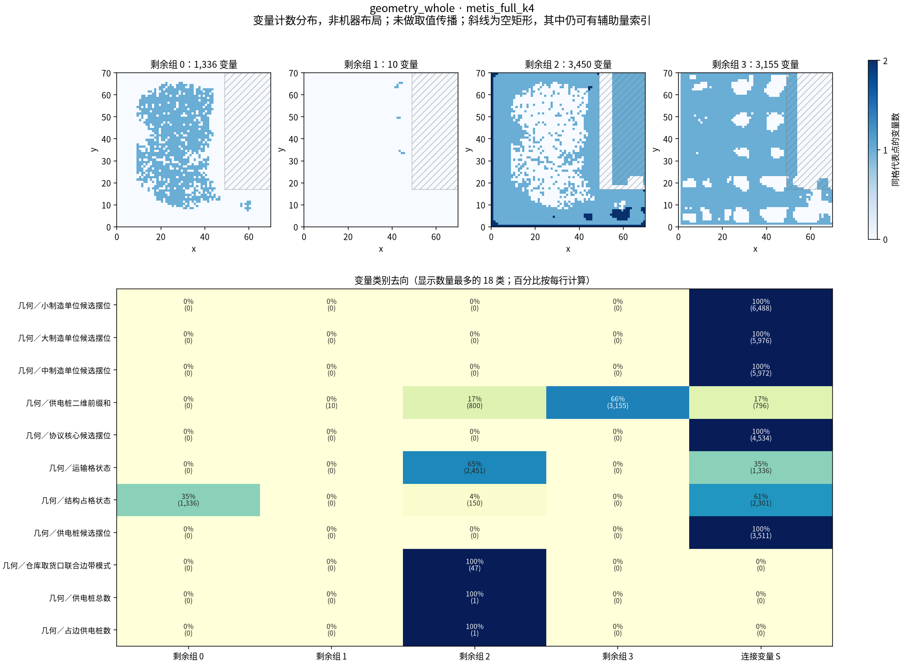
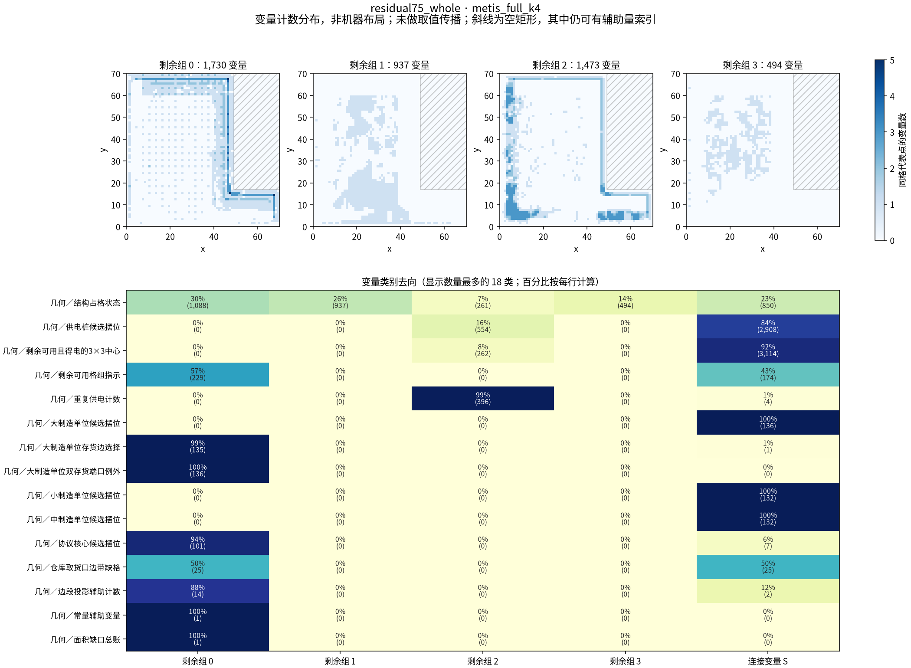

# 70×70 基地模型的结构检测

日期：2026-09-25（America/New_York）。状态：已完成。74 组划分已保存；只构建和检查变量出现关系，没有调用模型求解。

## 结论

**有非按地方分开的候选，但它们主要是建模变量类别的分组。** 纯几何模型的全场普通图，以及第 75 轮的全域普通图，出现了把结构占格、供电相关量等分到不同组的例子。两个流量模型的 14×14 窗口也出现了机型选择、端口流量、逐台收出量分别成组的例子。不能将这些例子称为独立生产链。

`layer="all"` 实际含两个网络：把源矿、蓝铁矿合并的矿石子集层，以及把所有物品相加的全体物品层；两层共用摆位、机型、运输格和桥接器状态。模型没有逐种物品的弧流量，也没有把每台制造单位收出量按配方比例连接。因此，本次没有得到“按单独物品或配方生产链分开”的检测结果。

全局台数、运输总数、物料收出总量和面积账会把各处变量连起来。把这些行拿开后看到的分块，只对保留的约束成立；每份明细另报仍跨剩余组的全局行。完整约束版则逐条检查了固定 S 后全部约束至多涉及一个剩余组。

**这里的独立是原始编码的变量出现关系。** 候选摆位变量数不是实际机器台数；固定 S 之后，一些辅助变量可能随之被确定。本次没有做预处理、取值传播、可行性搜索或约束推导，未检查下层还有多少有效自由度。

## 模型和范围

| 模型 | 原变量数 | 原约束数 | 全局行 | 构建用时 |
|---|---|---|---|---|
| 几何＋矿石子集层＋全体物品合计层 | 368,792 | 826,144 | 82 | 15.37 秒 |
| 几何＋矿石子集层 | 139,932 | 264,323 | 65 | 5.49 秒 |
| 1113 纯几何必要条件放松 | 38,865 | 101,640 | 59 | 2.87 秒 |
| 第 75 轮剩余供电格组全域放松（A 编码） | 12,119 | 42,134 | 10 | 1.67 秒 |

- 全体流量与矿石流量：直接调用 `flow_model_global.build(position, layer, cut_mode="formal")`，空矩形左下角 `(49,17)`、尺寸 `21×53`；保留全部 47 个仓库取货口联合边带模式和 P=10、11、12，`boundary_cuts=False`。没有调用 `run()` 或 `main()`。
- 纯几何：按 `1113放松/positions.json` 取 `(49,17)`，直接调用 `solve_relaxation.build(position, boundary_cuts=False)`；未使用 `(49,13)` 的旧导出文件。其 J 域是 0…6；流量目录几何编码的 J 域是 0…12，沿用各自原脚本。
- 第 75 轮：采用 `residual_model75.py` 的 A 编码，`cap=187`、偏移 `(0,1)`，3376 个中心、403 个格组，不固定旧见证，不固定 J 或 S 分支。只执行其已有建模语句，到 `if a.fixed` 之前停止。底座 `cp72.build(groups=False)` 显式保留触及四条边段的制造单位／协议核心候选和全域供电桩，再加剩余中心、格组；这本来就是该模型的范围，并非本次另删掉内部机器。

| 检测工具 | 全体流量 / 矿石流量 | 纯几何 | 第 75 轮 |
|---|---|---|---|
| KaHyPar 超图，完整／拿开全局行 | 均为全场，k=2、4、8 | 均为全场，k=2、4、8 | 均为全域，k=2、4、8 |
| METIS 普通图，完整约束 | 14×14 变量窗口，k=2、4、8 | 全场及 14×14 窗口，k=2、4、8 | 全域，k=2、4、8 |
| METIS 普通图，拿开全局行 | 全场及 14×14 窗口，k=2、4、8 | 全场及 14×14 窗口，k=2、4、8 | 全域，k=2、4、8 |
| 人工四象限参照 | 全场和窗口，各两种全局行口径 | 全场和窗口，各两种口径 | 全域，两种口径 |

### 两个流量模型的普通图缩了什么

完整全体流量、矿石流量按每条约束展开点对，分别产生 **2,453,280,448**、**896,007,522** 次无向点对（包含重复，不是去重边数）。这两项完整普通图没有展开并存下；用同一个 `[16,30)×[16,30)` 变量窗口控制内存。制造单位按候选机身中心选变量；格状态和弧流量按格代表点；供电桩二维前缀和按索引代表点；相关机型、逐台收出量跟随候选摆位；无坐标账目变量保留。然后对每条原约束取变量引用与窗口变量集合的交集。它是原图的诱导子图，不是一个新建的 14×14 游戏模型。

窗口保留的候选机身可能伸出窗口，外部变量也可能继续连接内部组。因此窗口里的 S 不能直接当作全场 S；各份明细给出同时固定全部窗口外变量后的总数。完整约束普通图和拿开全局行普通图都有同窗口结果，另有拿开全局行的全场结果，不混为同一规模。

| 变量窗口 | 变量数 | 接触该窗口的约束数 | 全局行 |
|---|---|---|---|
| 几何＋矿石子集层＋全体物品合计层 | 22,981 | 71,512 | 82 |
| 几何＋矿石子集层 | 8,477 | 27,243 | 65 |
| 1113 纯几何必要条件放松 | 2,401 | 15,973 | 59 |

## 怎么量

每个 CpModelProto 变量都是一个点，每条约束引用的变量集合是一条超边。引用包括 enforcement literal；负 literal 按 `-i-1` 还原变量编号。线性约束取变量表，布尔约束取 literal 表，表约束取表达式中的变量。脚本还实现了区间引用等类型的提取，并对未支持类型报错；本次实际出现的是 linear、bool_or、bool_and、exactly_one、table。不按系数大小加权，不先删除固定域变量。

普通图使用布尔稀疏矩阵 `B.T @ B`，去掉对角线并去重：同处一条约束就连一条无向边，不把一条超边换成星形图来交给 METIS。超图保留每条约束作为独立超边；只有空边和单点边不送进 KaHyPar，因为其跨组代价恒为零，统计及逐行复查仍保留它们。

两种表示计算切分代价的方式不同。例如，一条小制造单位总数等式，在普通图里会把全场所有小制造单位候选两两相连；在超图里仍是一条超边。普通图出现同类变量遍布全场却归为一组的结果，可以直接从这种连边方式理解，不需要把它解释成一条独立生产链。

METIS 做直接 k 路划分，KaHyPar 使用连接度减一（km1）目标；随机种子固定 20260925，不平衡参数 3%，变量和边权均为 1。完整全体流量 k=2 使用官方标准配置；其 k=4、8 使用 `km1_kKaHyPar_fm_4runs.ini`，从官方 eco 配置改为 FM 细化、初始划分 4 次；其余超图结果使用官方 eco 配置。各配置文件保存在 `tools/`，实际参数见原始 JSON。工具文档见 [PyMETIS](https://documen.tician.de/pymetis/functionality.html) 和 [KaHyPar 官方项目](https://github.com/kahypar/kahypar)。

人工参照按代表点切四象限：全场以 x=35、y=35 为界，窗口以 x=23、y=23 为界；无坐标变量放在西南组。没有按变量数配平。空矩形贴右上边界，不能把其四周机械分成四个非空边带，因此采用此四象限参照。

### S、L、C 与“块”

下文 S 指连接变量集合；第 75 轮模型另有一个名字也叫 `S` 的面积缺口总账变量，含义不同。

- **S（连接变量）**：从工具的跨组边取一个可验证的点分隔。把跨组超边按原变量数从大到小处理，同大小按原约束编号；每条边只保留当前剩余变量最多的一个组，把其他组变量放进 S，同数时保留组号小者。这覆盖了所有跨组普通图边；不是最小点分隔。
- **C（原跨组约束）**：取 S 以前，涉及至少两个工具分组的保留约束数。
- **L（连接约束）**：同时涉及 S 和至少一个剩余组的约束，并入所有被拿开的全局行。同一行只计一次。只涉及 S 的行另记为上层内部约束；若它同时是被拿开的全局行，也属于 L。
- **剩余组大小**：删去 S 后每个工具组的变量数；最小值包含空组。工具的 3% 平衡条件只管取 S 以前，不能用于这些剩余大小。
- **实际连通分量**：固定 S 后，在保留约束的变量—约束二部图中实际计算；单变量分量保留。它们可能远多于 k，因此另报数量和最大／最小值。

“地域／类别／混合”根据代表点分布、每组变量含义、同格变量是否同组共同描述。原始 JSON 还保存同格多数一致率及分组与类别、7×7 地域格的归一化互信息；这些只辅助描述，不作为选择优劣的分数。前缀和的数组索引不代表它只依赖那个地方，不能把图上的代表点当成完整物理作用范围。

## 全局约束单列

全局清单按源码语义确定，不根据划分结果反推：制造单位总台数、协议核心总数、供电桩总数和亏额预算、运输格合计、面积账、机型总收出量等。仓库取货口模式选择及少量只涉及 P/J 的总账也单列，尽管它们的变量数较少。局部逐格占用行即使有数百个候选变量也保留。每条全局行的编号、变量数、变量类别、代表点范围、源码位置见对应 JSON。

### 几何＋矿石子集层＋全体物品合计层：82 条

| 全局行含义 | 条数 | 每条引用变量数（最小…最大） |
|---|---|---|
| 仓库取货口联合边带模式恰选一个 | 1 | 47…47 |
| 制造单位按尺寸的总台数 | 3 | 5972…6488 |
| 协议核心总数 | 1 | 4534…4534 |
| 供电桩总数定义 | 1 | 3512…3512 |
| 占边供电桩总数定义 | 1 | 196…196 |
| 供电桩总数与占边数预算 | 1 | 2…2 |
| 供电亏额总预算 | 1 | 560…560 |
| 运输格总数下限 | 1 | 3787…3787 |
| 边带缺格条件下的运输格总数 | 47 | 3787…3787 |
| 面积缺口总账 | 1 | 138…138 |
| 供电桩总数面积预算 | 1 | 1…1 |
| 运输格与桥接器总数下限 | 1 | 7574…7574 |
| 制造单位按机型的总台数 | 9 | 11944…12976 |
| 粉碎机矿石总收量 | 1 | 12976…12976 |
| 精炼炉矿石总收量 | 1 | 12976…12976 |
| 按机型汇总的全体物品收出量 | 7 | 11952…12976 |
| 全制造单位全体物品总收量 | 1 | 13492…13492 |
| 全制造单位全体物品总出量 | 1 | 13492…13492 |
| 协议核心全体物品总存货量 | 1 | 10536…10536 |
| 全体物品运输弧与运输格容量总账 | 1 | 22442…22442 |

[逐条原始清单](models/flow_all/global_constraints.json)。

### 几何＋矿石子集层：65 条

| 全局行含义 | 条数 | 每条引用变量数（最小…最大） |
|---|---|---|
| 仓库取货口联合边带模式恰选一个 | 1 | 47…47 |
| 制造单位按尺寸的总台数 | 3 | 5972…6488 |
| 协议核心总数 | 1 | 4534…4534 |
| 供电桩总数定义 | 1 | 3512…3512 |
| 占边供电桩总数定义 | 1 | 196…196 |
| 供电桩总数与占边数预算 | 1 | 2…2 |
| 供电亏额总预算 | 1 | 560…560 |
| 运输格总数下限 | 1 | 3787…3787 |
| 边带缺格条件下的运输格总数 | 47 | 3787…3787 |
| 面积缺口总账 | 1 | 138…138 |
| 供电桩总数面积预算 | 1 | 1…1 |
| 运输格与桥接器总数下限 | 1 | 7574…7574 |
| 制造单位按机型的总台数 | 3 | 6488…12976 |
| 粉碎机矿石总收量 | 1 | 12976…12976 |
| 精炼炉矿石总收量 | 1 | 12976…12976 |

[逐条原始清单](models/flow_ore/global_constraints.json)。

### 1113 纯几何必要条件放松：59 条

| 全局行含义 | 条数 | 每条引用变量数（最小…最大） |
|---|---|---|
| 仓库取货口联合边带模式恰选一个 | 1 | 47…47 |
| 制造单位按尺寸的总台数 | 3 | 5972…6488 |
| 协议核心总数 | 1 | 4534…4534 |
| 供电桩总数定义 | 1 | 3512…3512 |
| 占边供电桩总数定义 | 1 | 196…196 |
| 供电桩总数与占边数预算 | 1 | 2…2 |
| 供电亏额总预算 | 1 | 560…560 |
| 运输格总数下限 | 1 | 3787…3787 |
| 边带缺格条件下的运输格总数 | 47 | 3787…3787 |
| 面积缺口总账 | 1 | 138…138 |
| 供电桩总数面积预算 | 1 | 1…1 |

[逐条原始清单](models/geometry/global_constraints.json)。

### 第 75 轮剩余供电格组全域放松（A 编码）：10 条

| 全局行含义 | 条数 | 每条引用变量数（最小…最大） |
|---|---|---|
| 仓库取货口两边缺格允许表 | 1 | 2…2 |
| 双存货端口例外总数 | 1 | 136…136 |
| 供电桩总数 | 1 | 3462…3462 |
| 保留制造单位与协议核心总数上限 | 4 | 108…136 |
| 重复供电与供电亏额总预算 | 1 | 1883…1883 |
| 面积缺口总账 | 1 | 747…747 |
| 剩余格组与保留制造单位总数 | 1 | 803…803 |

[逐条原始清单](models/residual75/global_constraints.json)。

## 数字总表

每行可点击进入该结果的中文明细，那里列出 S 全部类别及方向、L 全部类别、每个剩余组的含义和两句条件说明。`地/类/混/单` 分别表示地域、类别、混合、只剩一个非空组；箭头前后分别是取 S 前与取 S 后。实际分量一列为“数量；最大/最小”。

### 几何＋矿石子集层＋全体物品合计层 · 全场

| 方法 / 全局行口径 / k | 变量 / 保留约束 | S | L | C | 剩余最小…最大组 | 实际分量：数；最大/最小 | 分组含义 |
|---|---|---|---|---|---|---|---|
| [METIS / 拿开全局行 / 2](明细/flow_all_whole__metis_noglobal_k2.md) | 368,792 / 826,062 | 9,900 | 75,510 | 23,195 | 178,539…180,353 | 786；180,151/1 | 地域→地域 |
| [METIS / 拿开全局行 / 4](明细/flow_all_whole__metis_noglobal_k4.md) | 368,792 / 826,062 | 42,146 | 260,254 | 120,675 | 77,273…83,447 | 2,576；82,898/1 | 混合→地域 |
| [METIS / 拿开全局行 / 8](明细/flow_all_whole__metis_noglobal_k8.md) | 368,792 / 826,062 | 75,804 | 395,781 | 186,522 | 30,588…41,373 | 19,102；40,809/1 | 混合→混合 |
| [KaHyPar / 完整约束 / 2](明细/flow_all_whole__kahypar_full_k2.md) | 368,792 / 826,144 | 160,047 | 341,440 | 21,555 | 95,884…112,861 | 4；112,861/1 | 地域→地域 |
| [KaHyPar / 完整约束 / 4](明细/flow_all_whole__kahypar_full_k4.md) | 368,792 / 826,144 | 225,514 | 249,589 | 74,675 | 11,776…73,282 | 3,561；73,282/1 | 混合→类别 |
| [KaHyPar / 完整约束 / 8](明细/flow_all_whole__kahypar_full_k8.md) | 368,792 / 826,144 | 265,549 | 226,563 | 106,680 | 0…39,975 | 4,215；39,457/1 | 混合→混合 |
| [KaHyPar / 拿开全局行 / 2](明细/flow_all_whole__kahypar_noglobal_k2.md) | 368,792 / 826,062 | 10,948 | 71,753 | 21,398 | 174,081…183,763 | 636；183,395/1 | 地域→地域 |
| [KaHyPar / 拿开全局行 / 4](明细/flow_all_whole__kahypar_noglobal_k4.md) | 368,792 / 826,062 | 25,138 | 167,286 | 51,225 | 83,265…89,655 | 1,863；89,316/1 | 地域→地域 |
| [KaHyPar / 拿开全局行 / 8](明细/flow_all_whole__kahypar_noglobal_k8.md) | 368,792 / 826,062 | 53,487 | 290,408 | 96,474 | 33,917…41,941 | 5,037；41,685/1 | 混合→地域 |
| [人工四象限 / 完整约束 / 4](明细/flow_all_whole__manual_full_k4.md) | 368,792 / 826,144 | 210,338 | 231,587 | 58,311 | 6,415…115,711 | 2,282；115,711/1 | 地域→地域 |
| [人工四象限 / 拿开全局行 / 4](明细/flow_all_whole__manual_noglobal_k4.md) | 368,792 / 826,062 | 23,860 | 160,813 | 58,232 | 41,617…116,812 | 1,873；116,389/1 | 地域→地域 |

### 几何＋矿石子集层＋全体物品合计层 · 14×14 变量窗口

| 方法 / 全局行口径 / k | 变量 / 保留约束 | S | L | C | 剩余最小…最大组 | 实际分量：数；最大/最小 | 分组含义 |
|---|---|---|---|---|---|---|---|
| [METIS / 完整约束 / 2](明细/flow_all_window__metis_full_k2.md) | 22,981 / 71,512 | 6,442 | 31,749 | 16,507 | 7,145…9,394 | 8；6,361/700 | 类别→类别 |
| [METIS / 完整约束 / 4](明细/flow_all_window__metis_full_k4.md) | 22,981 / 71,512 | 7,314 | 35,486 | 25,875 | 2,365…4,820 | 15；4,820/13 | 类别→类别 |
| [METIS / 完整约束 / 8](明细/flow_all_window__metis_full_k8.md) | 22,981 / 71,512 | 10,760 | 32,202 | 37,546 | 8…2,467 | 19；2,467/3 | 类别→类别 |
| [METIS / 拿开全局行 / 2](明细/flow_all_window__metis_noglobal_k2.md) | 22,981 / 71,430 | 2,927 | 18,583 | 7,593 | 9,589…10,465 | 532；10,122/1 | 混合→混合 |
| [METIS / 拿开全局行 / 4](明细/flow_all_window__metis_noglobal_k4.md) | 22,981 / 71,430 | 5,183 | 28,424 | 12,856 | 3,948…4,671 | 1,325；4,523/1 | 混合→混合 |
| [METIS / 拿开全局行 / 8](明细/flow_all_window__metis_noglobal_k8.md) | 22,981 / 71,430 | 6,327 | 29,472 | 18,205 | 1,023…2,418 | 1,132；2,261/1 | 混合→混合 |
| [人工四象限 / 完整约束 / 4](明细/flow_all_window__manual_full_k4.md) | 22,981 / 71,512 | 15,142 | 13,473 | 12,829 | 691…5,754 | 228；5,754/1 | 地域→地域 |
| [人工四象限 / 拿开全局行 / 4](明细/flow_all_window__manual_noglobal_k4.md) | 22,981 / 71,430 | 5,334 | 24,472 | 12,753 | 3,721…5,092 | 840；4,919/1 | 地域→地域 |

### 几何＋矿石子集层 · 全场

| 方法 / 全局行口径 / k | 变量 / 保留约束 | S | L | C | 剩余最小…最大组 | 实际分量：数；最大/最小 | 分组含义 |
|---|---|---|---|---|---|---|---|
| [METIS / 拿开全局行 / 2](明细/flow_ore_whole__metis_noglobal_k2.md) | 139,932 / 264,258 | 4,306 | 35,276 | 11,904 | 67,604…68,022 | 137；67,987/1 | 地域→地域 |
| [METIS / 拿开全局行 / 4](明细/flow_ore_whole__metis_noglobal_k4.md) | 139,932 / 264,258 | 11,088 | 78,712 | 29,046 | 30,551…33,004 | 292；32,897/1 | 地域→地域 |
| [METIS / 拿开全局行 / 8](明细/flow_ore_whole__metis_noglobal_k8.md) | 139,932 / 264,258 | 20,869 | 110,817 | 50,822 | 12,805…15,865 | 554；15,835/1 | 地域→地域 |
| [KaHyPar / 完整约束 / 2](明细/flow_ore_whole__kahypar_full_k2.md) | 139,932 / 264,323 | 47,550 | 135,587 | 10,834 | 32,280…60,102 | 2；60,102/32,280 | 地域→地域 |
| [KaHyPar / 完整约束 / 4](明细/flow_ore_whole__kahypar_full_k4.md) | 139,932 / 264,323 | 72,709 | 144,458 | 25,221 | 10,210…29,910 | 180；29,900/1 | 地域→地域 |
| [KaHyPar / 完整约束 / 8](明细/flow_ore_whole__kahypar_full_k8.md) | 139,932 / 264,323 | 85,082 | 147,648 | 41,848 | 4,993…12,578 | 567；12,409/1 | 地域→地域 |
| [KaHyPar / 拿开全局行 / 2](明细/flow_ore_whole__kahypar_noglobal_k2.md) | 139,932 / 264,258 | 4,237 | 34,612 | 10,614 | 67,612…68,083 | 47；68,076/1 | 地域→地域 |
| [KaHyPar / 拿开全局行 / 4](明细/flow_ore_whole__kahypar_noglobal_k4.md) | 139,932 / 264,258 | 11,254 | 76,885 | 25,196 | 30,736…33,039 | 134；32,991/1 | 地域→地域 |
| [KaHyPar / 拿开全局行 / 8](明细/flow_ore_whole__kahypar_noglobal_k8.md) | 139,932 / 264,258 | 27,559 | 117,616 | 46,957 | 12,866…15,840 | 844；15,800/1 | 混合→地域 |
| [人工四象限 / 完整约束 / 4](明细/flow_ore_whole__manual_full_k4.md) | 139,932 / 264,323 | 65,496 | 152,966 | 25,948 | 5,333…42,869 | 1,056；42,869/1 | 地域→地域 |
| [人工四象限 / 拿开全局行 / 4](明细/flow_ore_whole__manual_noglobal_k4.md) | 139,932 / 264,258 | 9,219 | 73,183 | 25,886 | 16,963…43,189 | 183；43,157/1 | 地域→地域 |

### 几何＋矿石子集层 · 14×14 变量窗口

| 方法 / 全局行口径 / k | 变量 / 保留约束 | S | L | C | 剩余最小…最大组 | 实际分量：数；最大/最小 | 分组含义 |
|---|---|---|---|---|---|---|---|
| [METIS / 完整约束 / 2](明细/flow_ore_window__metis_full_k2.md) | 8,477 / 27,243 | 1,665 | 7,373 | 3,312 | 3,284…3,528 | 2；3,528/3,284 | 类别→类别 |
| [METIS / 完整约束 / 4](明细/flow_ore_window__metis_full_k4.md) | 8,477 / 27,243 | 4,665 | 11,108 | 9,776 | 364…1,600 | 32；1,538/1 | 类别→类别 |
| [METIS / 完整约束 / 8](明细/flow_ore_window__metis_full_k8.md) | 8,477 / 27,243 | 5,307 | 11,635 | 13,309 | 60…852 | 39；852/1 | 类别→类别 |
| [METIS / 拿开全局行 / 2](明细/flow_ore_window__metis_noglobal_k2.md) | 8,477 / 27,178 | 1,491 | 9,235 | 4,347 | 3,484…3,502 | 97；3,425/1 | 混合→混合 |
| [METIS / 拿开全局行 / 4](明细/flow_ore_window__metis_noglobal_k4.md) | 8,477 / 27,178 | 2,523 | 9,128 | 6,947 | 768…1,841 | 196；1,797/1 | 混合→混合 |
| [METIS / 拿开全局行 / 8](明细/flow_ore_window__metis_noglobal_k8.md) | 8,477 / 27,178 | 2,825 | 9,012 | 8,815 | 510…896 | 225；866/1 | 混合→混合 |
| [人工四象限 / 完整约束 / 4](明细/flow_ore_window__manual_full_k4.md) | 8,477 / 27,243 | 4,714 | 7,692 | 4,968 | 525…2,142 | 81；2,142/1 | 地域→地域 |
| [人工四象限 / 拿开全局行 / 4](明细/flow_ore_window__manual_noglobal_k4.md) | 8,477 / 27,178 | 1,972 | 7,810 | 4,909 | 1,486…1,893 | 108；1,841/1 | 地域→地域 |

### 1113 纯几何必要条件放松 · 全场

| 方法 / 全局行口径 / k | 变量 / 保留约束 | S | L | C | 剩余最小…最大组 | 实际分量：数；最大/最小 | 分组含义 |
|---|---|---|---|---|---|---|---|
| [METIS / 完整约束 / 2](明细/geometry_whole__metis_full_k2.md) | 38,865 / 101,640 | 30,114 | 94,247 | 74,760 | 0…8,751 | 2；4,761/3,990 | 类别→仅一组 |
| [METIS / 完整约束 / 4](明细/geometry_whole__metis_full_k4.md) | 38,865 / 101,640 | 30,914 | 72,692 | 87,898 | 10…3,450 | 1,341；3,155/1 | 类别→类别 |
| [METIS / 完整约束 / 8](明细/geometry_whole__metis_full_k8.md) | 38,865 / 101,640 | 32,159 | 73,897 | 95,818 | 0…2,990 | 1,667；2,316/1 | 类别→类别 |
| [METIS / 拿开全局行 / 2](明细/geometry_whole__metis_noglobal_k2.md) | 38,865 / 101,581 | 3,117 | 22,120 | 8,981 | 17,570…18,178 | 4；18,176/1 | 地域→地域 |
| [METIS / 拿开全局行 / 4](明细/geometry_whole__metis_noglobal_k4.md) | 38,865 / 101,581 | 7,456 | 43,448 | 21,695 | 7,509…8,128 | 145；8,115/1 | 地域→地域 |
| [METIS / 拿开全局行 / 8](明细/geometry_whole__metis_noglobal_k8.md) | 38,865 / 101,581 | 15,753 | 55,775 | 33,647 | 2,283…3,461 | 159；3,459/1 | 地域→地域 |
| [KaHyPar / 完整约束 / 2](明细/geometry_whole__kahypar_full_k2.md) | 38,865 / 101,640 | 16,521 | 48,350 | 8,550 | 5,421…16,923 | 78；16,923/1 | 地域→混合 |
| [KaHyPar / 完整约束 / 4](明细/geometry_whole__kahypar_full_k4.md) | 38,865 / 101,640 | 25,826 | 56,307 | 19,601 | 1,386…5,032 | 758；5,032/1 | 地域→地域 |
| [KaHyPar / 完整约束 / 8](明细/geometry_whole__kahypar_full_k8.md) | 38,865 / 101,640 | 30,671 | 37,148 | 32,740 | 371…1,790 | 1,936；1,746/1 | 地域→地域 |
| [KaHyPar / 拿开全局行 / 2](明细/geometry_whole__kahypar_noglobal_k2.md) | 38,865 / 101,581 | 3,038 | 21,515 | 8,495 | 17,856…17,971 | 4；17,969/1 | 地域→地域 |
| [KaHyPar / 拿开全局行 / 4](明细/geometry_whole__kahypar_noglobal_k4.md) | 38,865 / 101,581 | 9,256 | 43,604 | 19,843 | 7,181…7,876 | 21；7,876/1 | 地域→地域 |
| [KaHyPar / 拿开全局行 / 8](明细/geometry_whole__kahypar_noglobal_k8.md) | 38,865 / 101,581 | 20,322 | 54,057 | 33,273 | 991…3,598 | 35；3,595/1 | 地域→地域 |
| [人工四象限 / 完整约束 / 4](明细/geometry_whole__manual_full_k4.md) | 38,865 / 101,640 | 22,915 | 69,015 | 19,988 | 871…10,388 | 1,054；10,388/1 | 地域→地域 |
| [人工四象限 / 拿开全局行 / 4](明细/geometry_whole__manual_noglobal_k4.md) | 38,865 / 101,581 | 6,995 | 42,049 | 19,932 | 4,364…10,946 | 6；10,944/1 | 地域→地域 |

### 1113 纯几何必要条件放松 · 14×14 变量窗口

| 方法 / 全局行口径 / k | 变量 / 保留约束 | S | L | C | 剩余最小…最大组 | 实际分量：数；最大/最小 | 分组含义 |
|---|---|---|---|---|---|---|---|
| [METIS / 完整约束 / 2](明细/geometry_window__metis_full_k2.md) | 2,401 / 15,973 | 1,948 | 4,795 | 2,884 | 124…329 | 5；257/20 | 地域→类别 |
| [METIS / 完整约束 / 4](明细/geometry_window__metis_full_k4.md) | 2,401 / 15,973 | 1,997 | 3,993 | 4,365 | 43…174 | 46；165/1 | 混合→类别 |
| [METIS / 完整约束 / 8](明细/geometry_window__metis_full_k8.md) | 2,401 / 15,973 | 2,039 | 4,537 | 5,590 | 10…153 | 41；153/1 | 混合→类别 |
| [METIS / 拿开全局行 / 2](明细/geometry_window__metis_noglobal_k2.md) | 2,401 / 15,914 | 891 | 3,199 | 1,700 | 661…849 | 5；801/1 | 地域→地域 |
| [METIS / 拿开全局行 / 4](明细/geometry_window__metis_noglobal_k4.md) | 2,401 / 15,914 | 1,264 | 3,231 | 3,011 | 156…396 | 7；347/1 | 地域→地域 |
| [METIS / 拿开全局行 / 8](明细/geometry_window__metis_noglobal_k8.md) | 2,401 / 15,914 | 1,812 | 2,647 | 4,919 | 22…155 | 24；155/1 | 混合→地域 |
| [人工四象限 / 完整约束 / 4](明细/geometry_window__manual_full_k4.md) | 2,401 / 15,973 | 1,605 | 2,608 | 3,570 | 33…637 | 78；637/1 | 地域→地域 |
| [人工四象限 / 拿开全局行 / 4](明细/geometry_window__manual_noglobal_k4.md) | 2,401 / 15,914 | 1,454 | 3,085 | 3,517 | 123…476 | 7；427/1 | 地域→地域 |

### 第 75 轮剩余供电格组全域放松（A 编码） · 全场

| 方法 / 全局行口径 / k | 变量 / 保留约束 | S | L | C | 剩余最小…最大组 | 实际分量：数；最大/最小 | 分组含义 |
|---|---|---|---|---|---|---|---|
| [METIS / 完整约束 / 2](明细/residual75_whole__metis_full_k2.md) | 12,119 / 42,134 | 6,227 | 29,812 | 19,076 | 2,158…3,734 | 601；3,643/1 | 混合→混合 |
| [METIS / 完整约束 / 4](明细/residual75_whole__metis_full_k4.md) | 12,119 / 42,134 | 7,485 | 31,838 | 19,348 | 494…1,730 | 1,462；1,483/1 | 类别→混合 |
| [METIS / 完整约束 / 8](明细/residual75_whole__metis_full_k8.md) | 12,119 / 42,134 | 7,821 | 23,429 | 18,871 | 148…1,038 | 845；1,018/1 | 混合→地域 |
| [METIS / 拿开全局行 / 2](明细/residual75_whole__metis_noglobal_k2.md) | 12,119 / 42,124 | 1,220 | 6,076 | 1,742 | 5,087…5,812 | 190；5,812/1 | 地域→地域 |
| [METIS / 拿开全局行 / 4](明细/residual75_whole__metis_noglobal_k4.md) | 12,119 / 42,124 | 2,366 | 11,556 | 4,235 | 2,189…2,991 | 355；2,991/1 | 地域→地域 |
| [METIS / 拿开全局行 / 8](明细/residual75_whole__metis_noglobal_k8.md) | 12,119 / 42,124 | 4,155 | 18,016 | 7,511 | 491…1,355 | 580；1,355/1 | 地域→地域 |
| [KaHyPar / 完整约束 / 2](明细/residual75_whole__kahypar_full_k2.md) | 12,119 / 42,134 | 2,956 | 10,625 | 1,240 | 3,674…5,489 | 190；5,481/1 | 地域→地域 |
| [KaHyPar / 完整约束 / 4](明细/residual75_whole__kahypar_full_k4.md) | 12,119 / 42,134 | 4,416 | 13,571 | 2,775 | 1,533…2,729 | 376；2,727/1 | 地域→地域 |
| [KaHyPar / 完整约束 / 8](明细/residual75_whole__kahypar_full_k8.md) | 12,119 / 42,134 | 5,255 | 16,470 | 4,924 | 655…1,293 | 467；1,293/1 | 地域→地域 |
| [KaHyPar / 拿开全局行 / 2](明细/residual75_whole__kahypar_noglobal_k2.md) | 12,119 / 42,124 | 1,110 | 5,559 | 1,218 | 5,194…5,815 | 187；5,815/1 | 地域→地域 |
| [KaHyPar / 拿开全局行 / 4](明细/residual75_whole__kahypar_noglobal_k4.md) | 12,119 / 42,124 | 2,416 | 10,642 | 2,808 | 2,070…2,940 | 360；2,940/1 | 地域→地域 |
| [KaHyPar / 拿开全局行 / 8](明细/residual75_whole__kahypar_noglobal_k8.md) | 12,119 / 42,124 | 4,304 | 17,315 | 4,922 | 674…1,461 | 700；1,460/1 | 地域→地域 |
| [人工四象限 / 完整约束 / 4](明细/residual75_whole__manual_full_k4.md) | 12,119 / 42,134 | 4,117 | 13,322 | 3,048 | 674…3,424 | 319；3,424/1 | 地域→地域 |
| [人工四象限 / 拿开全局行 / 4](明细/residual75_whole__manual_noglobal_k4.md) | 12,119 / 42,124 | 2,279 | 9,651 | 3,039 | 1,029…3,436 | 333；3,434/1 | 地域→地域 |

## 结构例子

### 全体流量窗口：按机型、端口与收出量类别分

如果上层先定下列出的连接变量（主要包括全体层：制造单位取货端口流量、全体层：制造单位存货端口流量、塑形机候选摆位及存货边），并把窗口外变量也作为已定输入，完整约束就不会再同时用到两个下层组的未定变量。

下层组0主要是全体层：协议核心存货端口流量、全体层：相邻运输格流量；组1主要是全体层：全体物品合计出量：塑形机、全体层：全体物品合计出量：灌装机；组2主要是封装机候选摆位及存货边、种植机候选摆位及存货边；组3主要是全体层：全体物品合计收量：塑形机、全体层：全体物品合计收量：灌装机。

数字：S=7,314，L=35,486；剩余各组为 4,267、4,215、4,820、2,365 个变量。[完整明细](明细/flow_all_window__metis_full_k4.md)。



### 全体流量全场：拿开全局行后按地域分

如果上层先定下列出的连接变量（主要包括供电桩二维前缀和、全体层：协议核心存货端口流量、全体层：制造单位取货端口流量），拿开全局行后的保留约束就不会再同时用到两个下层组的未定变量。

下层组0主要是全体层：相邻运输格流量、矿石层：相邻运输格流量；组1主要是全体层：相邻运输格流量、矿石层：相邻运输格流量。另有 79 条已拿开的全局行仍跨这些组，原模型须继续处理它们。

数字：S=9,900，L=75,510；剩余各组为 178,539、180,353 个变量。[完整明细](明细/flow_all_whole__metis_noglobal_k2.md)。



### 纯几何全场：辅助量与空间变量分组

如果上层先定下列出的连接变量（主要包括小制造单位候选摆位、大制造单位候选摆位、中制造单位候选摆位），完整约束就不会再同时用到两个下层组的未定变量。

下层组0主要是结构占格状态；组1主要是供电桩二维前缀和；组2主要是运输格状态、供电桩二维前缀和；组3主要是供电桩二维前缀和。

数字：S=30,914，L=72,692；剩余各组为 1,336、10、3,450、3,155 个变量。[完整明细](明细/geometry_whole__metis_full_k4.md)。



### 第 75 轮全域：供电相关量与占格量分组

如果上层先定下列出的连接变量（主要包括剩余可用且得电的3×3中心、供电桩候选摆位、结构占格状态），完整约束就不会再同时用到两个下层组的未定变量。

下层组0主要是结构占格状态、剩余可用格组指示；组1主要是结构占格状态；组2主要是供电桩候选摆位、重复供电计数；组3主要是结构占格状态。

数字：S=7,485，L=31,838；剩余各组为 1,730、937、1,473、494 个变量。[完整明细](明细/residual75_whole__metis_full_k4.md)。



## 复查、限制与文件

所有构建导出的 CpModelProto 都通过 `validate()`，这只检查编码合法性。`verify_outputs.py` 另从原始 protobuf 逐行重新提取实际约束引用，不复用提取函数，核对 signed literal、窗口引用、每组 S/L 全量编号与固定 S 后的跨组行数。METIS 的切边数、KaHyPar 的切超边数和 km1 也从原始输入重新计算。检查结果见 [verification.json](verification.json)。

GCG 未运行：环境没有 GCG/SCIP；PyGCGOpt 没有适用的二进制 wheel，源码安装又因缺少 `scip/type_retcode.h` 失败。两次安装尝试均在 15 分钟限额内停止，日志见 [二进制安装](logs/gcg_install.log)、[源码安装](logs/gcg_source_install.log)。

全体流量完整超图的 k=4 标准配置、k=4 eco 配置和 k=8 eco 配置均达到 360 秒未结束。随后 k=4、8 的 FM 配置分别在约 342 秒完成，完整超图未缩小。原始超时日志保留在 `logs/`；超时不表示不存在分隔。

- `models/<模型>/model.pb`：原始构建模型；`metadata.json`：参数、规模、输入散列；`variables.json`：全部变量名、含义和代表点；`incidence.npz`：精确超边引用。
- `raw/<模型>_<范围>/input.npz`：划分用的引用、原编号映射、全局行掩码；`partitions/*.json`：工具原始分组；`analyses/*.json`：完整 S/L 编号、分类及检查结果。
- `raw/*/graph_*.npz`：实际用于 METIS 的去重普通图；配套 JSON 记录边数。
- [全部结果索引](result_index.json)、[依赖版本](requirements.txt)、[环境与工具状态](environment.json)、[原建模源码及输入快照](source_snapshot/manifest.json)、[证据文件散列](manifest.json)。
- `scripts/build_extract.py`、`prepare.py`、`partition_run.py`、`analyze.py`、`verify_outputs.py`、`write_report.py`：构建、分类、工具执行、分隔核验、报告生成。构建脚本禁用字节码并拦截输出目录外写入；它把 CpSolver.solve 替换成报错函数。

复查已有结果（不建模、不划分、不求解）：

```bash
PYTHONDONTWRITEBYTECODE=1 求解器/结构检测/2026-09-25/.venv/bin/python -B 求解器/结构检测/2026-09-25/scripts/verify_outputs.py
```

本次未改任何已有建模文件，未操作模拟器，未执行 git 命令。依赖、编译临时文件、缓存、日志和交付物均放在本目录。
